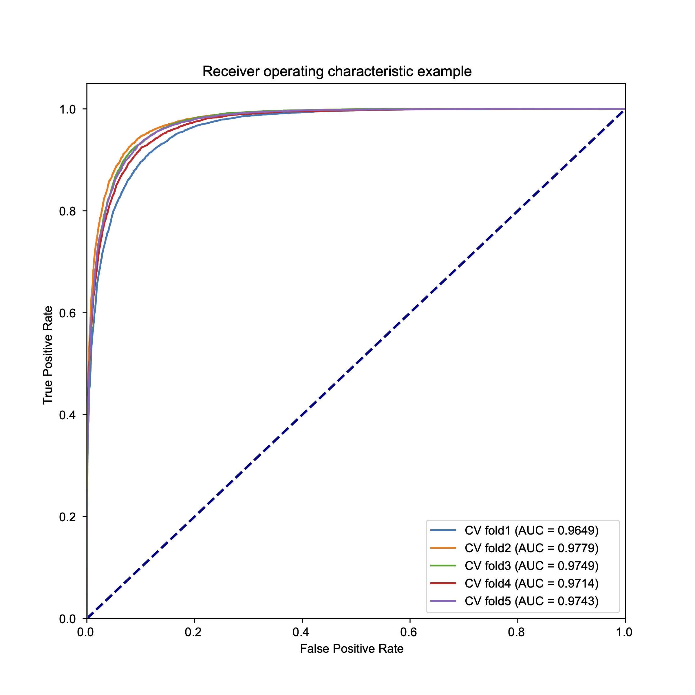
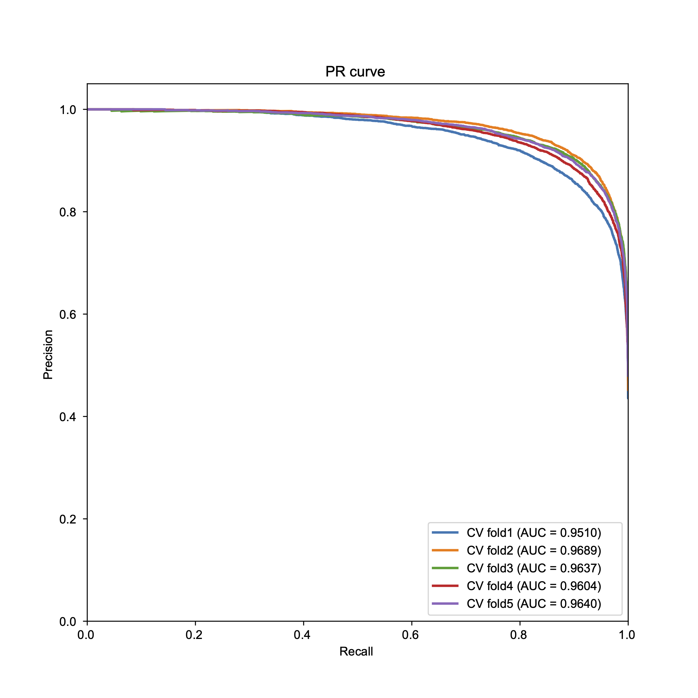
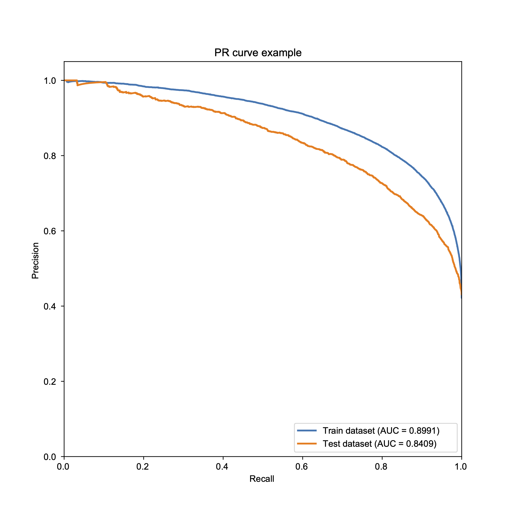

```{r , include=FALSE}
options(max.print = "120")
knitr::opts_chunk$set(echo = TRUE, comment = "#>", eval = TRUE, collapse = TRUE,cache = FALSE,warning = FALSE)
knitr::opts_knit$set(width = 120)
```

```{r r-lib , include = FALSE}
library(tidyverse)
library(reticulate)
library(DT)
use_python(Sys.which("python"))
```

```{python BA-packages, include = FALSE}
import pandas as pd
import matplotlib.pyplot as plt
import matplotlib as mpl
mpl.rcParams['pdf.fonttype'] = 42
mpl.rcParams['ps.fonttype'] = 42
plt.rcParams.update({'font.family':'Arial'})
import seaborn as sns
import numpy as np
from sklearn.metrics import confusion_matrix,accuracy_score
from sklearn.metrics import roc_curve,auc,precision_score,recall_score
import matplotlib as mpl
```

This part focuses on Binding affinity (BA) model construction. it contains the following sections:

- [Training data](#training-data) - Data download and process
- [BA model](#ba-model-training) - constructed BA model by LSTM
- [BA model perforemance](#ba-model-perforemance) - Compared the performance of BA model with other models on independent dataset.

## Training data 

### Data download

The same binding affinity data used for training NetMHCIIpan were used to train our model，you can find the data in [IEDB](http://tools.iedb.org/mhcii/download/), the details are described as below:

1.data processing: combine & drop duplicates

```{r BA_data}
#R
path <- "../data/NetMHCIIpan_train/"
read_file <- function(name,path) {
  df = tibble()
  for (i in 1:5) {
    x <-  data.table::fread(str_c(path,name,i,".txt"),data.table = F,header = F)
    df <- rbind(df,x)
  }
  return(df)
}
train_BA <- read_file("train_BA",path)
test_BA <- read_file("test_BA",path)

pseudo_sequence <- data.table::fread("../data/pseudosequence.2016.all.X.dat",data.table = F,header = F)#pseudo seq for MHC
BA <- rbind(train_BA,test_BA)
BA_filtered <- BA %>% filter(str_detect(V3,"D")) %>% select(V1,V2,V3)
colnames(pseudo_sequence) <- c("MHC","sequence")
colnames(BA_filtered) <- c("peptide","IC50","MHC")
BA_filtered_MHC <- left_join(BA_filtered,pseudo_sequence)
#na.omit(BA_filter_MHC)
BA_filtered_MHC <- unique(BA_filtered_MHC)
dim(BA_filtered_MHC)
length(table(unique(BA_filtered_MHC$MHC)))
```

These data comprise 107,008 measurements of peptide–MHC binding affinity covering 71 types of class II MHCs from humans.

2.change normalized IC50 to binary label: IC50 is normalized by log50k transformed binding affinity (i.e. 1 - log50k( aff nM)) method, and a threshold of 500 nM is used. This means that peptides with log50k transformed binding affinity values greater than 0.426 are classified as binders(true label: 1)

```{r BA-label}
#R
BA_filtered_MHC["label"] = ifelse(BA_filtered_MHC$IC50>0.426,1,0) #set positive and negative
write_csv(BA_filtered_MHC,"../data/BA_MHC_label.csv")
BA_allele <- unique(BA_filtered_MHC$MHC)
write_lines(BA_allele,"../data/BA_allele.csv")
```

### Show data feature

```{python BA-fig}
#python
BA = pd.read_csv("../data/BA_MHC_label.csv")
BA["length"] = BA["peptide"].map(len)
BA_positive = BA[BA["label"] == 1]
BA_negative = BA[BA["label"] == 0]

def MHC_dis_plot(Data,color,colname):
    value = Data[colname].value_counts().values
    index = Data[colname].value_counts().index
    norm_value = value/sum(value)
    a = list(index[0:15])
    b = list(norm_value[0:15])
    a.append("other ({})".format(len(value)-15))
    b.append(sum(norm_value[15:]))
    fig,ax = plt.subplots(figsize = (8,7))
    plt.bar(a,b,color = color)
    plt.ylim([0,0.45])
    plt.yticks([0.00,0.05,0.10,0.15,0.20,0.25,0.30,0.35,0.40])
    plt.xticks(rotation = 90)
```

We show the distribution of allele in different labels:

```{python}
#python
MHC_dis_plot(BA_positive,"green","MHC")
plt.tight_layout()
plt.savefig("../figure/BA_MHC_positive.pdf",dpi = 300,transparent=True)
plt.show()
```

```{python BA-negative}
#python
MHC_dis_plot(BA_negative,"red","MHC")
plt.tight_layout()
plt.savefig("../figure/BA_MHC_negative.pdf",dpi = 300,transparent=True)
plt.show()
```

The converted affinity value of negative samples is around 0.2, while that of positive samples is around 0.6:

```{python BA-boxplot}
#python
sns.boxplot(data = BA,x="label",y="IC50")
plt.ylim([-0.1,1.1])
plt.xlabel("Label")
plt.ylabel("Binding affinity")
plt.yticks(np.arange(0,1.2,0.2))
plt.xticks((0,1),labels = ["Negative","Positive"])
plt.savefig("../figure/BA_label_boxplot.pdf",dpi = 300,transparent=True)
plt.show()
```

15mer peptides account for the largest proportion of Binding affinity data.

```{python BA-immuno-rate}
#python
pos_len_value = list(BA_positive["length"].value_counts().values)
pos_len_index = BA_positive["length"].value_counts().index
norm_pos_len_value = BA_positive["length"].value_counts().values/sum(BA_positive["length"].value_counts())
neg_len_value = list(BA_negative["length"].value_counts().values)
neg_len_index = BA_negative["length"].value_counts().index
norm_neg_len_value = BA_negative["length"].value_counts().values/sum(BA_negative["length"].value_counts())
fig,ax = plt.subplots()
width = 0.35
x = pos_len_index
ax.bar(pos_len_index - width/2, norm_pos_len_value,width,label='immunogenic',color = "green")
ax.bar(neg_len_index + width/2, norm_neg_len_value, width, label='noimmunogenic',color = "red")
ax.set_ylabel('proportion')
ax.set_xlabel('length')
ax.set_title('Distribution of Length')
ax.set_xticks(x)
ax.legend()
plt.savefig("../figure/length_dis_label.pdf",dpi = 300,transparent=True)
plt.show()
```

## BA model training

Unlike NetMHCIIpan4.0, we use the LSTM layer to construct our model. Antigen sequences and MHC pseudo-sequences are used as inputs. We used two LSTM layers with output sizes of 128,64 on top of the antigen and MHC inputs. The LSTM outputs of antigen and MHC are concatenated in the same layer to form a 128-dimensional vector. This layer is followed by three dense layers with 100, 50, and 10 neurons activated by RELU, and the last output layer is a single neuron dense layer activated by sigmoid.

The input of this model is the peptides sequence and the MHC sequence. The output is whether the peptides bind to the MHC molecule or not. We used 5-fold cross-validation and the training results are shown in training histrory.

### Structure

Here are the script that are used to train the BA model, this job is done on HPC:

```{python model-structure,eval = FALSE}
#PBS
#python
import pandas as pd
import numpy as np
import tensorflow as tf
import tensorflow as tf
from tensorflow import keras
from tensorflow.keras import layers
from sklearn.model_selection import train_test_split,KFold
from sklearn.metrics import auc,precision_recall_curve,roc_curve,confusion_matrix
import sys
sys.path.append("/public/slst/home/wanggsh/Project/MHCII/utils")
from NN_data import NN_Data
from Blosum62 import blosum62
import matplotlib.pyplot as plt
from collections import Counter
import os

version = 2

BA = pd.read_csv("/public/slst/home/wanggsh/Data/MHCII/netMHCpanII4.0_train_data/BA_data/BA_MHC_label.csv")
BA = BA.drop_duplicates()
BA = BA.reset_index(drop=True)
#pep
BA["pep_blosum"] = BA["peptide"].apply(blosum62,args=(21,))
BA["MHC_blosum"] = BA["sequence"].apply(blosum62,args=(34,))
peptide = np.empty((len(BA),21,21))
for i in range(len(BA)):
    peptide[i] = BA["pep_blosum"][i].reshape((21,21))
#mhc 
MHC = np.empty((len(BA),34,21))
for i in range(len(BA)):
    MHC[i] = BA["MHC_blosum"][i].reshape((34,21))
#score
labels = BA["score"].values

#class weight
neg, pos = np.bincount(BA["score"])
total = neg + pos
print('Examples:\n    Total: {}\n    Positive: {} ({:.2f}% of total)\n'.format(
    total, pos, 100 * pos / total))
weight_for_0 = (1 / neg) * (total / 2.0)
weight_for_1 = (1 / pos) * (total / 2.0)
class_weight = {0: weight_for_0, 1: weight_for_1}
print('Weight for class 0: {:.2f}'.format(weight_for_0))
print('Weight for class 1: {:.2f}'.format(weight_for_1))

#split test
pep_Train,pep_test,MHC_Train,MHC_test,label_Train,label_test = train_test_split(peptide,MHC,labels,test_size=0.1,random_state=202205,stratify=labels)#random_state=202205
print(Counter(label_Train))
print(Counter(label_test))

def ELmodel():
    inputA = tf.keras.Input(shape = (21,21))
    inputB = tf.keras.Input(shape = (34,21))
    
    x = tf.keras.layers.LSTM(128,return_sequences=True)(inputA)
    x = tf.keras.layers.LSTM(64,return_sequences=True)(x)
    x = tf.keras.layers.Flatten()(x)
    x = tf.keras.Model(inputs = inputA,outputs = x)

    y = tf.keras.layers.LSTM(128,return_sequences=True)(inputB)
    y = tf.keras.layers.LSTM(64,return_sequences=True)(y)
    y = tf.keras.layers.Flatten()(y)
    y = tf.keras.Model(inputs = inputB,outputs = y)

    combined = tf.keras.layers.concatenate([x.output,y.output])

    z = tf.keras.layers.Dense(100,activation="relu")(combined)
    z = tf.keras.layers.Dense(50,activation = "relu")(z)
    z = tf.keras.layers.Dense(10,activation = "relu")(z)
    z = tf.keras.layers.Dense(1,activation = "sigmoid")(z)

    model = tf.keras.Model(inputs = [inputA,inputB],outputs = z)

    return model


callback = tf.keras.callbacks.EarlyStopping(monitor='val_loss', patience=10)
Loss = keras.losses.BinaryCrossentropy()
Optimizer = keras.optimizers.Adam(learning_rate = 0.00008)
Metrics = [tf.keras.metrics.AUC(),tf.keras.metrics.BinaryAccuracy(),tf.keras.metrics.AUC(curve = "PR"),tf.keras.metrics.Precision()] 
Batch_size= 512
Epochs= 100
Verbose = 2 #reduce information output

print("Cross Validation")
kf = KFold(n_splits=5,shuffle = True)
ROC = {}
PR = {}
i = 1
for train_index,val_index in kf.split(label_Train):
    pep_train,MHC_train,label_train = pep_Train[train_index],MHC_Train[train_index],label_Train[train_index]
    pep_val,MHC_val,label_val = pep_Train[val_index],MHC_Train[val_index],label_Train[val_index]
    print(Counter(label_train))
    print(Counter(label_val))
    model = ELmodel()
    model.compile(
        loss = Loss,
        optimizer = Optimizer,
        metrics = Metrics)
    #callback
    history = model.fit([pep_Train,MHC_Train],label_Train,
        batch_size=Batch_size,epochs=Epochs,
        validation_data = ([pep_val,MHC_val],label_val),
        callbacks = callback,verbose = Verbose,
        class_weight=class_weight)
    His_df = pd.DataFrame(history.history)
    His_df.to_csv("/public/slst/home/wanggsh/Project/Saved_model/BA_model_history/corss_history{0}.csv".format(i))
    prediction = model.predict([pep_val,MHC_val])
    fpr,tpr,thresholds = roc_curve(label_val,prediction,pos_label=1)
    area_mine = auc(fpr,tpr)
    ROC["flod{}".format(i)] = [fpr,tpr,thresholds,area_mine]
    print("=============={} auc data finish==========".format(i))
    precision,recall,thresholds = precision_recall_curve(label_val,prediction,pos_label=1)
    area_PR = auc(recall,precision)
    PR["flod{}".format(i)] = [recall,precision,thresholds,area_PR]
    print("=============={} pr data finish==========".format(i))
     i = i+1

#----plot cross fig
ROC_df = pd.DataFrame(ROC)
fig = plt.figure()
lw = 2
ax = fig.add_subplot(111)
ax.plot([0, 1], [0, 1], color='navy', lw=lw, linestyle='--')
for i in range(5):
    ax.plot(ROC_df.iloc[0,i],ROC_df.iloc[1,i],label='flod{0} (area = {1:.4f})'.format(i,ROC_df.iloc[3,i]))
ax.set_ylim([0,1.05])
ax.set_xlim([0,1])
ax.set_xlabel('False Positive Rate')
ax.set_ylabel('True Positive Rate')
ax.set_title('Receiver operating characteristic example')
ax.legend(loc="lower right")
plt.savefig("/public/slst/home/wanggsh/Project/Saved_model/Model_fig/BA_model/BA_ROC_cross.pdf",dpi = 300)
PR_df = pd.DataFrame(PR)
plt.figure()
lw = 2
for i in range(5):
    plt.plot(PR_df.iloc[0,i],PR_df.iloc[1,i],lw=lw, label = 'flod{0} (area = {1:.4f})'.format(i,PR_df.iloc[3,i]))
plt.xlim([0.0, 1.0])
plt.ylim([0.0, 1.05])
plt.xlabel('Recall')
plt.ylabel('Precision')
plt.title('PR curve')
plt.legend(loc="lower right")
plt.savefig("/public/slst/home/wanggsh/Project/Saved_model/Model_fig/BA_model/BA_PR_cross.pdf",dpi = 300)
print("start model training")

model = ELmodel()

model.compile(
        loss = Loss,
        optimizer = Optimizer,
        metrics = Metrics)
#callback
history = model.fit([pep_Train,MHC_Train],label_Train,
        batch_size=Batch_size,epochs=Epochs,
        validation_data = ([pep_test,MHC_test],label_test),
        callbacks = callback,verbose = Verbose,
        class_weight=class_weight)
model.save(r"/public/slst/home/wanggsh/Project/Saved_model/new_BA_model/model1")

print("start plt fig")
His_df = pd.DataFrame(history.history)
His_df.to_csv("/public/slst/home/wanggsh/Project/Saved_model/BA_model_history/history.csv")

prediction = model.predict([pep_test,MHC_test])
Train_pre = model.predict([pep_Train,MHC_Train])
fpr,tpr,thresholds = roc_curve(label_test,prediction,pos_label=1)
train_fpr,train_tpr,_ = roc_curve(label_Train,Train_pre,pos_label=1)
area_mine = auc(fpr,tpr)
area_mine_train = auc(train_fpr,train_tpr)
print(area_mine)
print(area_mine_train)

precision,recall,thresholds = precision_recall_curve(label_test,prediction,pos_label=1)
precision_train,recall_train,_ = precision_recall_curve(label_Train,Train_pre,pos_label=1)
area_PR = auc(recall,precision)
area_PR_train = auc(recall_train,precision_train)

fig = plt.figure()
lw = 2
ax = fig.add_subplot(111)
ax.plot([0, 1], [0, 1], color='navy', lw=lw, linestyle='--')
ax.plot(train_fpr,train_tpr,label='Train AUC = (area = {0:.4f})'.format(area_mine_train))
ax.plot(fpr,tpr,label='Test AUC = (area = {0:.4f})'.format(area_mine))
ax.set_ylim([0,1.05])
ax.set_xlim([0,1])
ax.set_xlabel('False Positive Rate')
ax.set_ylabel('True Positive Rate')
ax.set_title('Receiver operating characteristic example')
ax.legend(loc="lower right")
plt.savefig("/public/slst/home/wanggsh/Project/Saved_model/Model_fig/BA_model/ROC.pdf",dpi = 300)

plt.figure()
lw = 2
plt.plot(recall_train,precision_train,lw=lw, label = 'Train AUC = (area = {0:.4f})'.format(area_PR_train))
plt.plot(recall,precision,lw=lw, label = 'Test AUC = (area = {0:.4f})'.format(area_PR))
plt.xlim([0.0, 1.0])
plt.ylim([0.0, 1.05])
plt.xlabel('Recall')
plt.ylabel('Precision')
plt.title('PR curve example')
plt.legend(loc="lower right")

plt.savefig("/public/slst/home/wanggsh/Project/Saved_model/Model_fig/BA_model/PR.pdf",dpi = 300)

print("finish")
```

### Train history fig

We use 5-fold cross validation to validate our model. Cross validation: The training results of the model are very stable, the average AUC of ROC is 0.97, and the average AUC of PR is 0.96. 





held out dataset: 




## BA model perforemance

We compare the performance of our BA with other models on an independent dataset. we compare [netMHCIIpan 4.0 BA](http://tools.iedb.org/mhcii/download/) and [mixMHC2pred](https://github.com/GfellerLab/MixMHC2pred).

### Benchmark data preprecess

We collected independent datasets Automated from Andreatta et al. and drop duplicated data with training dataset. we also change binding affinity into binary label by log50k transformed method.

```{r Automated-data,message=FALSE}
#R
Dataset <- read_table("../data/mhcii_initial_benchmark_datasets.tsv")
Dataset_binary <- Dataset %>% filter(measurement_type == "binary")
Dataset_ic50 <- Dataset %>% filter(measurement_type == "ic50")
fun <- function(x){
  if(x<=500){y=1}
  else{y=0}
  return(y)
}
quativate <- sapply(Dataset_ic50$measurement_value, fun)
Dataset_ic50$measurement_value <- quativate
Dataset_final <- rbind(Dataset_binary,Dataset_ic50)
pseduo_seq <- read_table("../data/pseudosequence.2016.all.X.dat",col_names = c("allele","sequence"))
fun <- function(x){
  if (str_detect(x,"\\/")){
    x = str_remove_all(x,"\\*")
    x = str_remove_all(x,"\\:")
    x = str_replace(x,"\\/","-")
  }
  else{
    x = str_replace(x,"HLA-","")
    x = str_replace(x,"\\*","_")
    x = str_replace(x,"\\:","")
  }
  return(x)
}
Dataset_final$allele1 = sapply(Dataset_final$allele,fun)
Dataset_final <- left_join(Dataset_final,pseduo_seq, by = c("allele1" = "allele"))
Dataset_final <-  na.omit(Dataset_final)
Dataset_final$length <- sapply(Dataset_final$peptide_sequence,nchar)
Dataset_final <- Dataset_final %>% filter(length>=13&length<=21)
BA <- read_csv("../data/BA_MHC_label.csv")
Automated_filter <- anti_join(Dataset_final,BA,by = c("peptide_sequence" = "peptide","allele1"="MHC")) #Delete the data contained in the training dataset
write_csv(Dataset_final,"../data/Automated_benchmark.csv")
write_csv(Automated_filter,"../data/Automated_benchmark_filter.csv")
```

The Automated dataset are shown below：

```{r BA-show-data}
DT::datatable(Automated_filter,rownames = FALSE)
```

### Result

The process of using the different tools is shown below, all processes are done on HPC.

BAmodel:

```{python BA-auto-result,eval = FALSE}
#python
import tensorflow as tf
import pandas as pd
import numpy as np
model = tf.keras.models.load_model("/public/slst/home/wanggsh/Project/Saved_model/new_BA_model/model")
Data = pd.read_feather("/public/slst/home/wanggsh/Data/MHCII/Benchmark/Automated_benchmark_filter.feather")
BA_allele = pd.read_csv("/public/slst/home/wanggsh/Data/MHCII/netMHCpanII4.0_train_data/BA_data/BA_allele.csv",header=None,names=["allele"])
bool = Data["Allele Name1"].map(lambda X : X in BA_allele["allele"].values)
Data = Data[bool] 
print(len(Data))
print("Data finish")
Data = Data.reset_index(drop = True)
peptide = np.empty((len(Data),21,21))
for i in range(len(Data)):
    peptide[i] = Data["pep_blosum"][i].reshape((21,21))
#mhc
MHC = np.empty((len(Data),34,21))
for i in range(len(Data)):
    MHC[i] = Data["MHC_blosum"][i].reshape((34,21))

label = Data['label'].values
Y = model.predict([peptide,MHC]).flatten()
Data["prediction"] = Y

allele = Data["Allele Name1"].unique()
BA_result = Data
BA_result.to_csv("/public/slst/home/wanggsh/Data/MHCII/Benchmark/BA_model/BA_Automated_prediction_result.csv")
```

NetMHCIIpan:

```{python netMHCIIpan_BA_result,eval = FALSE}
#python
import pandas as pd
import os
import sys

result_file_path = "/public/slst/home/wanggsh/Data/MHCII/Benchmark"
EL = pd.read_csv("/public/slst/home/wanggsh/Data/MHCII/Benchmark/Automated_benchmark_filter.csv")
EL.index = range(len(EL))
allele = EL["Allele Name"].unique()
PD = pd.DataFrame()
comd = "python /public/slst/home/wanggsh/biosoft/mhc_ii/mhc_II_binding.py netmhciipan_ba"
file_path = "{0}/pep.csv".format(result_file_path)

for i in allele:
    aEL = EL[EL["Allele Name"] == i]
    length = aEL["length"].unique()
    for l in length:
        lEL = aEL[EL["length"] == l] 
        lEL["Description"].to_csv("{0}".format(file_path),header = False,index = False)
        os.system("{0} {1} {2} {3} > {4}/result.txt".format(comd,i,file_path,l,result_file_path))
        result = pd.read_table("{0}/result.txt".format(result_file_path))
        PD= result.append(PD)
    PD.to_csv("{0}/netMHCIIpan_Auto_filter_ba_result.csv".format(result_file_path))
print("finish")
```

mixMHC2pred:

```{python mixMHC2pred_result,eval = FALSE}
#python
import pandas as pd
import os
import sys
import re

result_file_path = "/public/slst/home/wanggsh/Data/MHCII/Benchmark"
EL = pd.read_csv("/public/slst/home/wanggsh/Data/MHCII/Benchmark/Automated_benchmark_filter.csv")
def allele_change(x):
    if len(x) < 10:
        x = x[0:7]+"_"+x[7:]
    else :
        x = re.sub("HLA-","",x)
        x = x[0:4]+"_"+x[4:6]+"_"+x[6:13]+"_"+x[13:15]+"_"+x[15:]
        x = re.sub("-","__",x)
    return x
EL["new_allele"] = EL["Allele Name1"].map(allele_change)
EL.to_csv("/public/slst/home/wanggsh/Data/MHCII/Benchmark/mixMHC2pred_Automated.csv")
allele = EL["new_allele"].unique()
PD = pd.DataFrame()
comd = "/public/slst/home/wanggsh/biosoft/MixMHC2pred-master/MixMHC2pred_unix --no_context"
file_path = "{0}/pep.csv".format(result_file_path)
result = "{0}/result.txt".format(result_file_path)

for i in allele:
    aEL = EL[EL["new_allele"] == i]
    aEL["Description"].to_csv("{0}".format(file_path),header = False,index = False)
    os.system("{0} -i {1} -o {2} -a {3}".format(comd,file_path,result,i))
    result_file = pd.read_table("{0}".format(result),comment="#")
    PD = pd.concat([result_file,PD])
    
PD.to_csv("{0}/mixMHC2pred_Auto_filter_ba_result.csv".format(result_file_path))
print("finish")
```

### Plt ROC fig

The area under the curve (AUC) of the receiver operating characteristic (ROC) is used as the evaluation index for model comparations:

```{python ROC_curve}
#python
Automate = pd.read_csv("../data/Automated_benchmark.csv")
BA_result = pd.read_csv("../data/BA_Automated_prediction_result.csv")
BA_fpr,BA_tpr,_ = roc_curve(BA_result["label"],BA_result["prediction"],pos_label=1)
BA_roc = auc(BA_fpr,BA_tpr)
netMHC_result = pd.read_csv("../data/netMHCIIpan_Auto_filter_ba_result.csv")
netMHC_result = netMHC_result[["allele","percentile_rank","peptide","ic50"]]
Automate = Automate[["allele","allele1","peptide_sequence","measurement_value"]]
netMHC_result = pd.merge(netMHC_result,Automate,left_on=["allele","peptide"],right_on=["allele","peptide_sequence"]).drop_duplicates()
BA_allele = pd.read_csv("../data/BA_allele.csv",header=None,names=["allele"])
bool = netMHC_result["allele1"].map(lambda x : x in BA_allele["allele"].values)
netMHC_result = netMHC_result[bool]
net_fpr,net_tpr,_ = roc_curve(netMHC_result["measurement_value"],1-netMHC_result["percentile_rank"],pos_label=1)
net_roc = auc(net_fpr,net_tpr)
mix_result = pd.read_csv("../data/mixMHC2pred_Auto_filter_ba_result.csv")
mix_data = pd.read_csv("../data/mixMHC2pred_Automated.csv")
mix_result = pd.merge(mix_result[["Peptide","BestAllele","%Rank_best"]],mix_data[["Description","new_allele","label","Allele Name1"]],left_on =["Peptide","BestAllele"],right_on=["Description","new_allele"]).drop_duplicates()
mix_result = mix_result[mix_result["Allele Name1"].isin(BA_allele["allele"])]
mix_fpr,mix_tpr,_ = roc_curve(mix_result["label"],1-mix_result["%Rank_best"],pos_label=1)
mix_roc = auc(mix_fpr,mix_tpr)
cmap = plt.get_cmap('Set1')
colors = [mpl.colors.rgb2hex(cmap(i)[:3]) for i in range(3)]
fig,ax = plt.subplots(figsize = (8,8))
lw = 2
plt.plot(BA_fpr,BA_tpr,lw=lw,color = colors[0],label="BA_model (AUC = %0.4f)" % BA_roc,)
plt.plot(net_fpr,net_tpr,lw=lw,color = colors[1],label="NetMHCIIpan_BA (AUC = %0.4f)" % net_roc,)
plt.plot(mix_fpr,mix_tpr,lw=lw,color = colors[2],label="mixMHC2pred (AUC = %0.4f)" % mix_roc,)
plt.plot([0, 1], [0, 1], color="navy", lw=lw, linestyle="--")
plt.xlim([0.0, 1.0])
plt.ylim([0.0, 1.05])
plt.xlabel("False Positive Rate",fontsize = 14,fontname='Arial')
plt.ylabel("True Positive Rate",fontsize = 14)
plt.title("")
plt.legend(loc="lower right",fontsize = 12)
plt.savefig("../figure/BA_model_benchmark.pdf",dpi = 300,transparent=True)
plt.show()
```

The BA model (AUC: 0.7742) shows better performance than MixMHC2pred (AUC: 0.6482) and has comparable performance with NetMHCIIpan (AUC: 0.7965). 

Next we plot the confusion matrix：

```{python}
from collections import Counter
fig,ax = plt.subplots(figsize = (8,8))
sns.countplot(data = Automate,x = "measurement_value")
ax.text(-0.1, 10950, "{:.3f}".format(Counter(Automate["measurement_value"])[0]/len(Automate)))
ax.text(0.9, 10950, "{:.3f}".format(Counter(Automate["measurement_value"])[1]/len(Automate)))
plt.ylabel("Number")
plt.xlabel("label")
plt.title("The distribution of different label in Automate")
plt.savefig("../figure/Automate_label_dis.pdf",dpi = 300,transparent=True)
plt.show()
```


```{python BA_confusion_matrix}
#python
BA_result["pre_label"] = BA_result["prediction"].map(lambda x : 1 if x>0.426 else 0)
BA_CM = confusion_matrix(BA_result["label"],BA_result["pre_label"])
BA_CM = BA_CM/len(BA_result)
netMHC_result["pre_label"] = netMHC_result["percentile_rank"].map(lambda x : 1 if x <2 else 0)
netMHC_CM = confusion_matrix(netMHC_result["measurement_value"],netMHC_result["pre_label"])
netMHC_CM = netMHC_CM/len(netMHC_result)
mix_result["pre_label"] = mix_result["%Rank_best"].map(lambda x : 1 if x <2 else 0)
mix_CM = confusion_matrix(mix_result["label"],mix_result["pre_label"])
mix_CM = mix_CM/len(mix_result)
```

```{python}
import math

def call_metrics(CM):
    tn = CM.ravel()[0]
    fp = CM.ravel()[1]
    fn = CM.ravel()[2]
    tp = CM.ravel()[3]
    se = tp/(tp+fn)
    sp = tn/(tn+fp)
    ppv = tp/(tp+fp)
    npv = tn/(tn+fn)
    f_score= 2*tp/(2*tp+fp+fn)
    DOP =  math.sqrt((se-1)**2+(sp-1)**2+(ppv-1)**2+(npv-1)**2)
    
    return se,sp,ppv,npv,f_score,DOP

call_metrics(BA_CM)
call_metrics(netMHC_CM)
call_metrics(mix_CM)
```
```{python}
fig,ax = plt.subplots(figsize = (8,6))
sns.heatmap(BA_CM, annot=True,cmap="YlGnBu",vmin=0, vmax=0.6)
plt.ylabel("True label")
plt.xlabel("Prediction label")
plt.title("BA model confusion matrix(threshold:0.426)")
plt.savefig("../figure/BA_CM.pdf",dpi = 300,transparent=True)
plt.show()
```

```{python net_BA_confusion_matrix}
#python
fig,ax = plt.subplots(figsize = (8,6))
sns.heatmap(netMHC_CM, annot=True,cmap="YlGnBu",vmin=0, vmax=0.6)
plt.ylabel("True label")
plt.xlabel("Prediction label")
plt.title("NetMHCIIpan_BA confusion matrix(Rank:10%)")
plt.savefig("../figure/netMHCIIpan_CM.pdf",dpi = 300,transparent=True)
plt.show()
```

```{python mixMHC2pred_confusion_matrix}
#python
fig,ax = plt.subplots(figsize = (8,6))
sns.heatmap(mix_CM,annot =True,cmap="YlGnBu",vmin=0, vmax=0.6)
plt.ylabel("True label")
plt.xlabel("Prediction label")
plt.title("MixMHC2pred confusion matrix(Rank:10%)")
plt.savefig("../figure/mixMHC2pred_CM.pdf",dpi = 300,transparent=True)
plt.show()
```

By using IEDB recommend cutoff 2%rank and 0.426 (500nm, log50k transformed), we found NetMHCIIpan and MixMHC2pred tend to predict the result as negative while our BA model can correctly distinguish between negatives and positives

```{python pre_recall_fig, include = FALSE}
#python
BA_precision = precision_score(BA_result["label"],BA_result["pre_label"])
BA_recall = recall_score(BA_result["label"],BA_result["pre_label"])
net_precision = precision_score(netMHC_result["measurement_value"],netMHC_result["pre_label"])
net_recall = recall_score(netMHC_result["measurement_value"],netMHC_result["pre_label"])
mix_precision = precision_score(mix_result["label"],mix_result["pre_label"])
mix_recall= recall_score(mix_result["label"],mix_result["pre_label"])
score = [BA_precision,BA_recall,net_precision,net_recall,mix_precision,mix_recall]
Type = ["Precision","Recall","Precision","Recall","Precision","Recall"]
method = ["BA_model","BA_model","NetMHCIIpan_BA","NetMHCIIpan_BA","MixMHC2pred","MixMHC2pred"]
plt.figure(figsize=(8,6))
sns.barplot(x = Type,y=score,hue = method,palette = "YlGnBu")
plt.ylabel("Score")
plt.savefig("../figure/pre_recall.pdf",dpi = 300,transparent=True)
plt.show()
```

