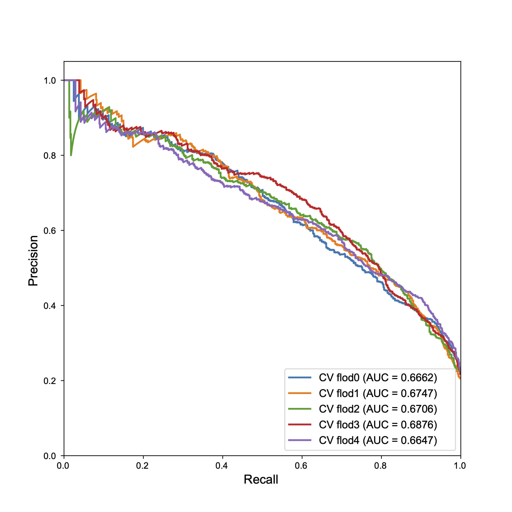
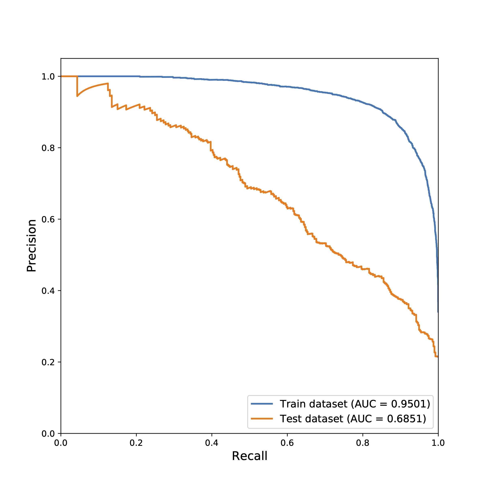

```{r , include=FALSE}
options(max.print = "120")
knitr::opts_chunk$set(echo = TRUE, comment = "#>", eval = TRUE, collapse = TRUE,cache = FALSE,warning = FALSE)
knitr::opts_knit$set(width = 120)
```

```{r , include=FALSE}
library(tidyverse)
library(reticulate)
library(DT)
library(stringr)
library(ggplot2)
use_python(Sys.which("python"))
```

```{python , inclued = FALSE}
import pandas as pd
import matplotlib.pyplot as plt
import matplotlib as mpl
mpl.rcParams['pdf.fonttype'] = 42
mpl.rcParams['ps.fonttype'] = 42
plt.rcParams.update({'font.family':'Arial'})
import seaborn as sns
import numpy as np
from sklearn.metrics import confusion_matrix,accuracy_score
from sklearn.metrics import roc_curve,auc,confusion_matrix,precision_score,recall_score,precision_recall_curve
import matplotlib as mpl
path = "~/Project/Documenet/TLIMM2pred/data/"
import random
```

## Data preprocessing

IEDB training set: we think ;this five assay type is more credible, so we choose this five assay type.

```{r IMM-data,message=FALSE}
#R
IEDB_immuno_MHCII <- read_csv("../data/IEDB_MHCII.csv")
pseduo_seq <- read_table("../data/pseudosequence.2016.all.X.dat",col_names = c("allele","sequence"))
colnames(IEDB_immuno_MHCII) <- IEDB_immuno_MHCII[1,]
IEDB_immuno_MHCII <- IEDB_immuno_MHCII[-1,]
IEDB_immuno_MHCII_filter <- IEDB_immuno_MHCII[,c(12,85,88,102,91,92,93)]  #4:pubmed ID
IEDB_immuno_MHCII_filter$`Qualitative Measure` <- str_replace(IEDB_immuno_MHCII_filter$`Qualitative Measure`,"Positive-High","Positive")
IEDB_immuno_MHCII_filter$`Qualitative Measure` <- str_replace(IEDB_immuno_MHCII_filter$`Qualitative Measure`,"Positive-Intermediate","Positive")
IEDB_immuno_MHCII_filter$`Qualitative Measure` <- str_replace(IEDB_immuno_MHCII_filter$`Qualitative Measure`,"Positive-Low","Positive")
IEDB_immuno_MHCII_filter <- IEDB_immuno_MHCII_filter[!(duplicated(IEDB_immuno_MHCII_filter)),]
IEDB_immuno_MHCII_filter$length <- sapply(IEDB_immuno_MHCII_filter$Description, nchar)
IEDB_immuno_MHCII_filter1 <- IEDB_immuno_MHCII_filter %>% filter(nchar(`Allele Name`)>=14) %>% filter(length>=13&length<=21) %>% 
  filter(`Method/Technique`=="51 chromium"|`Method/Technique`=="ELISA"|`Method/Technique`=="ELISPOT"|`Method/Technique`=="ICS"|`Method/Technique`=="multimer/tetramer") %>% filter(str_detect(`Allele Name`,"HLA"))
fun <- function(x){
  if (str_detect(x,"\\/")){
    x = str_remove_all(x,"\\*")
    x = str_remove_all(x,"\\:")
    x = str_replace(x,"\\/","-")
  }
  else{
    x = str_replace(x,"HLA-","")
    x = str_replace(x,"\\*","_")
    x = str_replace(x,"\\:","")
  }
  return(x)
}
IEDB_immuno_MHCII_filter1$`Allele Name1` <- sapply(IEDB_immuno_MHCII_filter1$`Allele Name`,fun)
IEDB_immuno_MHCII_filter1 <- left_join(IEDB_immuno_MHCII_filter1,pseduo_seq, by = c("Allele Name1" = "allele"))
IEDB_immuno_MHCII_filter_final <-  na.omit(IEDB_immuno_MHCII_filter1)  #with response
IEDB_immuno_MHCII_filter_final <- IEDB_immuno_MHCII_filter_final[!(duplicated(IEDB_immuno_MHCII_filter_final[,c(1,4)])),]

MHC_immuno_allele <- unique((IEDB_immuno_MHCII_filter_final$`Allele Name1`))
write_lines(MHC_immuno_allele,"IEDB_MHCII_immuno_allele.csv")
write_csv(IEDB_immuno_MHCII_filter_final,"IEDB_MHCII_immuno.csv")
# plt fig
ggplot(data = IEDB_immuno_MHCII_filter_final)+
  geom_histogram(aes(x = `Method/Technique`),stat = "count")+xlab("Expirement Type")+ylab("Number") + labs(title = "IEDB")+ theme(plot.title = element_text(hjust = 0.5))
ggplot(data = IEDB_immuno_MHCII_filter_final)+
  geom_histogram(aes(x = `Qualitative Measure`),stat = "count")+xlab("Label")+ylab("Number") + labs(title = "IEDB")+ theme(plot.title = element_text(hjust = 0.5))
```

```{python}
IMM_data = pd.read_csv("/Users/wangguangshuai/Data/MHCII/Data/IMM_model_train/IEDB_MHCII_immuno.csv")
sns.barplot(IMM_data["Qualitative Measure"].value_counts().index,IMM_data["Qualitative Measure"].value_counts().values,palette =["green","red"])
plt.xlabel("Label")
plt.ylabel("Number")
plt.savefig("../figure/IMM_label.pdf",dpi = 300,transparent=True)
allele_pos = IMM_data[IMM_data["Qualitative Measure"] == "Positive"]
x = pd.DataFrame(allele_pos["Allele Name1"].value_counts())
x["frac"] = x["Allele Name1"].map(lambda y: y/sum(x["Allele Name1"].values))
a = list(x.index[0:15])
b = list(x["frac"].values[0:15])
a.append("Others")
b.append(sum(x["frac"].values[15:]))
fig,ax = plt.subplots()
plt.bar(a,b,color = "green")
plt.ylim([0,0.3])
plt.yticks([0.00,0.05,0.10,0.15,0.20,0.25])
plt.xticks(rotation = 90)
plt.savefig("../figure/allele_pos.pdf",dpi = 300,bbox_inches='tight',transparent=True)
plt.show()
allele_neg = IMM_data[IMM_data["Qualitative Measure"] == "Negative"]
x = pd.DataFrame(allele_neg["Allele Name1"].value_counts())
x["frac"] = x["Allele Name1"].map(lambda y: y/sum(x["Allele Name1"].values))
a = list(x.index[0:15])
b = list(x["frac"].values[0:15])
a.append("Others")
b.append(sum(x["frac"].values[15:]))
fig,ax = plt.subplots(figsize = (8,6))
ax = plt.bar(a,b,color = "red")
plt.ylim([0,0.3])
plt.yticks([0.00,0.05,0.10,0.15,0.20,0.25])
plt.xticks(rotation = 90)
plt.savefig("../figure/allele_neg.pdf",dpi = 300,bbox_inches='tight',transparent=True)
plt.show()
pos_len_value = list(allele_pos["length"].value_counts().values)
pos_len_index = allele_pos["length"].value_counts().index
norm_pos_len_value = allele_pos["length"].value_counts().values/sum(allele_pos["length"].value_counts())
neg_len_value = list(allele_neg["length"].value_counts().values)
neg_len_index = allele_neg["length"].value_counts().index
norm_neg_len_value = allele_neg["length"].value_counts().values/sum(allele_neg["length"].value_counts())
fig,ax = plt.subplots(figsize = (8,6))
width = 0.35
x = pos_len_index
ax.bar(pos_len_index - width/2, norm_pos_len_value,width,label='immunogenic',color = "green")
ax.bar(neg_len_index + width/2, norm_neg_len_value, width, label='noimmunogenic',color = "red")
ax.set_ylabel('proportion')
ax.set_xlabel('length')
ax.set_title('Distribution of Length')
ax.set_xticks(x)
ax.legend()
plt.savefig("../figure/length.pdf",dpi = 300,bbox_inches='tight',transparent=True)
plt.show()
```

IEDB bechmark data: reduce duplicates data in training dataset

```{r IEDB-benchmark}
#R
IEDB_immuno_MHCII_filter2 <- IEDB_immuno_MHCII_filter %>% filter(nchar(`Allele Name`)>=14) %>% filter(length>=13&length<=21) %>% 
  filter(!(`Method/Technique`=="51 chromium"|`Method/Technique`=="ELISA"|`Method/Technique`=="ELISPOT"|`Method/Technique`=="ICS"|`Method/Technique`=="multimer/tetramer")) %>% 
  filter(str_detect(`Allele Name`,"HLA"))

IEDB_immuno_MHCII_filter2$`Allele Name1` <- sapply(IEDB_immuno_MHCII_filter2$`Allele Name`,fun)
IEDB_immuno_MHCII_filter2 <- left_join(IEDB_immuno_MHCII_filter2,pseduo_seq, by = c("Allele Name1" = "allele"))
IEDB_immuno_MHCII_benchmark <-  na.omit(IEDB_immuno_MHCII_filter2) # only response
IEDB_immuno_MHCII_benchmark <- IEDB_immuno_MHCII_benchmark[!(duplicated(IEDB_immuno_MHCII_benchmark[,c(1,4)])),]
bool1 <- IEDB_immuno_MHCII_benchmark$Description %in% IEDB_immuno_MHCII_filter_final$Description
bool2 <- IEDB_immuno_MHCII_benchmark$`Allele Name` %in% IEDB_immuno_MHCII_filter_final$`Allele Name`
IEDB_immuno_MHCII_benchmark_final <- IEDB_immuno_MHCII_benchmark[bool1&bool2,]
write_csv(IEDB_immuno_MHCII_benchmark_final,"../data/IEDB_benchmark.csv")
```

## Model train

we compare 1,2,3,4,5 and 10 times random nagative peptide, we found 2 times random nagative peptide is more acccuracy. so we use 2 times random negative peptide to train model.

### Get random peptide as decoay

```{python random_peptide,eval = FALSE}
#python
f=open("../data/uniport_human.fasta")
ls=[]
for line in f:
        if not line.startswith('>'):
                ls.append(line.replace('\n',''))
f.close()
uniport = pd.DataFrame(ls)
uniport["length"] = uniport[0].map(len)
bool = uniport["length"]>30
uniport = uniport[bool]
bool = uniport[0].apply(lambda x: set(list(x)).issubset(set(list("ARNDCQEGHILKMFPSTWYVX"))))
uniport = uniport[bool]
uniport_random = uniport[0].values
def random_select(x,length,num,allele):
    df = []
    all = []
    for i in range(num):
        protein_num = random.randint(0,len(x)-1)
        protein = x[protein_num]
        peptide_num = random.randint(0,len(protein)-length)
        peptide = protein[peptide_num:peptide_num+length]
        df.append(peptide)
        all.append(allele)
    return df,all
IMM_data = pd.read_csv("../data/IEDB_MHCII_immuno.csv")
negative = []
allele = []
time = 2 # negative times
for i in range(time):
    for i in IMM_data["Allele Name1"].unique():
        smal_IMM = IMM_data[IMM_data["Allele Name1"] == i]["length"].value_counts()
        for l in range(len(smal_IMM)):
            length = int(smal_IMM.index[l])
            num = int(smal_IMM.values[l])
            pep,all = random_select(uniport_random,length,num,i)
            negative.extend(pep)
            allele.extend(all)

IMM_data = IMM_data[["Description","Qualitative Measure","Allele Name1"]]
random_data = pd.DataFrame({"Description":negative,"Allele Name1":allele})
random_data["Qualitative Measure"] = "Negative"
final_data = pd.concat([IMM_data,random_data],axis=0)
final_data["label"] = final_data["Qualitative Measure"].map(lambda x : 1 if x == "Positive" else 0)
final_data = final_data.drop_duplicates()
pseudo_data = pd.read_table("../data/pseudosequence.2016.all.X.dat",header=None,names=["Allele Name1","sequence"])
pseudo_data = pseudo_data.drop_duplicates()
Data = pd.merge(final_data,pseudo_data).drop_duplicates()
#Data.to_csv("../data/IMM_data_random{}.csv".format(time))
```

because random select, it maybe different to our final data.

### model train

```{python train-model ,eval = FALSE}
#PBS
#python
import pandas as pd
import os
import tensorflow as tf
from tensorflow import keras
from tensorflow.keras import layers
from tensorflow.keras.layers import *
from sklearn.model_selection import train_test_split,KFold
import numpy as np
from collections import Counter
from sklearn.metrics import auc,precision_recall_curve,roc_curve,confusion_matrix,average_precision_score
from collections import Counter
import matplotlib.pyplot as plt
import sys
sys.path.append("/public/slst/home/wanggsh/Project/MHCII/utils")
from Blosum62 import blosum62
#Data process
immuno_data = pd.read_csv("/public/slst/home/wanggsh/Data/MHCII_immuno/IMM_data_random2.csv")
immuno_data["pep_blosum"] = immuno_data["Description"].apply(blosum62,args=(21,))
immuno_data["MHC_blosum"] = immuno_data["sequence"].apply(blosum62,args=(34,))
peptide = np.empty((len(immuno_data),21,21))
for i in range(len(immuno_data)):
    peptide[i] = immuno_data["pep_blosum"][i].reshape((21,21))
MHC = np.empty((len(immuno_data),34,21))
for i in range(len(immuno_data)):
    MHC[i] = immuno_data["MHC_blosum"][i].reshape((34,21))
labels = immuno_data["label"].values
BAmodel = tf.keras.models.load_model("/public/slst/home/wanggsh/Project/Saved_model/new_BA_model/model1")
BAmodel = tf.keras.models.Model(inputs = BAmodel.input,outputs = BAmodel.layers[-2].output)
BA = BAmodel.predict([peptide,MHC])
#class weight
neg, pos = np.bincount(immuno_data["label"])
total = neg + pos
print('Examples:\n    Total: {}\n    Positive: {} ({:.2f}% of total)\n'.format(
    total, pos, 100 * pos / total))
weight_for_0 = (1 / neg) * (total / 2.0)
weight_for_1 = (1 / pos) * (total / 2.0)
class_weight = {0: weight_for_0, 1: weight_for_1}
print('Weight for class 0: {:.2f}'.format(weight_for_0))
print('Weight for class 1: {:.2f}'.format(weight_for_1))
#
pep_Train,pep_Test,MHC_Train,MHC_Test,label_Train,label_Test,BA_Train,BA_Test = train_test_split(peptide,MHC,labels,BA,test_size=0.1,random_state=202205,stratify=labels)
print(Counter(label_Train))
print(Counter(label_Test))
print("Data progress finish!!")

def LSTMmodel():
    pep = tf.keras.Input(shape = (21,21))
    MHC = tf.keras.Input(shape = (34,21))
    BA = tf.keras.Input(shape = (10))

    x = tf.keras.layers.LSTM(256,return_sequences=True)(pep)
    x = tf.keras.layers.LSTM(128,return_sequences=True)(x)
    x = tf.keras.layers.Flatten()(x)
    x = tf.keras.Model(inputs = pep,outputs = x)

    y = tf.keras.layers.LSTM(256,return_sequences=True)(MHC)
    y = tf.keras.layers.LSTM(128,return_sequences=True)(y)
    y = tf.keras.layers.Flatten()(y)
    y = tf.keras.Model(inputs = MHC,outputs = y)

    combined = tf.keras.layers.concatenate([x.output,y.output,BA])

    z = tf.keras.layers.Dense(400,activation="relu")(combined)
    #z = tf.keras.layers.Dropout(0.8)(z)
    z = tf.keras.layers.Dense(200,activation = "relu")(z) #,kernel_regularizer=tf.keras.regularizers.l2(0.0001)
    #z = tf.keras.layers.Dropout(0.8)(z)
    z = tf.keras.layers.Dense(1,activation = "sigmoid")(z)

    model = tf.keras.Model(inputs = [pep,MHC,BA],outputs = z)
    return model
#learning rate
def get_lr_metric(optimizer):
    def lr(y_true, y_pred):
        curLR = optimizer._decayed_lr(tf.float32)
        return curLR 
    return lr

callback = tf.keras.callbacks.EarlyStopping(monitor='val_loss', patience=10)#change
Loss = keras.losses.BinaryCrossentropy()
Optimizer = keras.optimizers.Adam(learning_rate = 0.00008) #
lr_metric = get_lr_metric(Optimizer)
Metrics = [tf.keras.metrics.AUC(),tf.keras.metrics.BinaryAccuracy(),tf.keras.metrics.AUC(curve = "PR"),tf.keras.metrics.Precision()] 
Batch_size= 200
Epochs= 150
Verbose = 2 #reduce information output

#Cross validation
print("Cross Validation")
kf = KFold(n_splits=5,shuffle = True)
ROC = {}
PR = {}
i = 1
for train_index,val_index in kf.split(label_Train):
    pep_train,MHC_train,label_train,BA_train = pep_Train[train_index],MHC_Train[train_index],label_Train[train_index],BA_Train[train_index]
    pep_val,MHC_val,label_val,BA_val = pep_Train[val_index],MHC_Train[val_index],label_Train[val_index],BA_Train[val_index]
    print(Counter(label_train))
    print(Counter(label_val))
    model = LSTMmodel()
    model.compile(
        loss = Loss,
        optimizer = Optimizer,
        metrics = Metrics)
    #callback
    history = model.fit([pep_train,MHC_train,BA_train],label_train,
        batch_size=Batch_size,epochs=Epochs,
        validation_data = ([pep_val,MHC_val,BA_val],label_val),
        verbose = Verbose,
        class_weight=class_weight,callbacks = callback)
    His_df = pd.DataFrame(history.history)
    His_df.to_csv("/public/slst/home/wanggsh/Project/Saved_model/History/immuno/corss_history{0}.csv".format(i))
    prediction = model.predict([pep_val,MHC_val,BA_val])
    fpr,tpr,thresholds = roc_curve(label_val,prediction,pos_label=1)
    area_mine = auc(fpr,tpr)
    ROC["flod{}".format(i)] = [fpr,tpr,thresholds,area_mine]
    print("=============={} auc data finish==========".format(i))
    precision,recall,thresholds = precision_recall_curve(label_val,prediction,pos_label=1)
    area_PR = auc(recall,precision)
    PR["flod{}".format(i)] = [recall,precision,thresholds,area_PR]
    print("=============={} pr data finish==========".format(i))
    i = i+1
#----plot cross fig
ROC_df = pd.DataFrame(ROC)
fig = plt.figure()
lw = 2
ax = fig.add_subplot(111)
ax.plot([0, 1], [0, 1], color='navy', lw=lw, linestyle='--')
for i in range(5):
    ax.plot(ROC_df.iloc[0,i],ROC_df.iloc[1,i],label='flod{0} (area = {1:.4f})'.format(i,ROC_df.iloc[3,i]))
ax.set_ylim([0,1.05])
ax.set_xlim([0,1])
ax.set_xlabel('False Positive Rate')
ax.set_ylabel('True Positive Rate')
ax.set_title('Receiver operating characteristic example')
ax.legend(loc="lower right")
plt.savefig("/public/slst/home/wanggsh/Project/Saved_model/Model_fig/Immuno_model/ROC_cross.pdf",dpi = 300)
PR_df = pd.DataFrame(PR)
plt.figure()
lw = 2
for i in range(5):
    plt.plot(PR_df.iloc[0,i],PR_df.iloc[1,i],lw=lw, label = 'flod{0} (area = {1:.4f})'.format(i,PR_df.iloc[3,i]))
plt.xlim([0.0, 1.0])
plt.ylim([0.0, 1.05])
plt.xlabel('Recall')
plt.ylabel('Precision')
plt.title('PR curve')
plt.legend(loc="lower right")
plt.show()
plt.savefig("/public/slst/home/wanggsh/Project/Saved_model/Model_fig/Immuno_model/PR_cross.pdf",dpi = 300)
print("-"*20)
print("start model training")

model = LSTMmodel()

model.compile(
        loss = Loss,
        optimizer = Optimizer,
        metrics = Metrics)
#callback
history = model.fit([pep_Train,MHC_Train,BA_Train],label_Train,
        batch_size=Batch_size,epochs=Epochs,
        validation_data = ([pep_Test,MHC_Test,BA_Test],label_Test),
        verbose = Verbose,
        callbacks = callback) #class_weight=class_weight
model.save(r"/public/slst/home/wanggsh/Project/Saved_model/MHCII_immuno/model")

print("start plt fig")
His_df = pd.DataFrame(history.history)
His_df.to_csv("/public/slst/home/wanggsh/Project/Saved_model/History/immuno/history.csv")

prediction = model.predict([pep_Test,MHC_Test,BA_Test])
Train_pre = model.predict([pep_Train,MHC_Train,BA_Train])
fpr,tpr,thresholds = roc_curve(label_Test,prediction,pos_label=1)
train_fpr,train_tpr,_ = roc_curve(label_Train,Train_pre,pos_label=1)
area_mine = auc(fpr,tpr)
area_mine_train = auc(train_fpr,train_tpr)
print(area_mine)
print(area_mine_train)

precision,recall,thresholds = precision_recall_curve(label_Test,prediction,pos_label=1)
precision_train,recall_train,_ = precision_recall_curve(label_Train,Train_pre,pos_label=1)
area_PR = auc(recall,precision)
area_PR_train = auc(recall_train,precision_train)

fig = plt.figure()
lw = 2
ax = fig.add_subplot(111)
ax.plot([0, 1], [0, 1], color='navy', lw=lw, linestyle='--')
ax.plot(train_fpr,train_tpr,label='Train AUC = (area = {0:.4f})'.format(area_mine_train))
ax.plot(fpr,tpr,label='Test AUC = (area = {0:.4f})'.format(area_mine))
ax.set_ylim([0,1.05])
ax.set_xlim([0,1])
ax.set_xlabel('False Positive Rate')
ax.set_ylabel('True Positive Rate')
ax.set_title('Receiver operating characteristic example')
ax.legend(loc="lower right")
plt.savefig("/public/slst/home/wanggsh/Project/Saved_model/Model_fig/Immuno_model/ROC.pdf",dpi = 300)

plt.figure()
lw = 2
plt.plot(recall_train,precision_train,lw=lw, label = 'Train AUC = (area = {0:.4f})'.format(area_PR_train))
plt.plot(recall,precision,lw=lw, label = 'Test AUC = (area = {0:.4f})'.format(area_PR))
plt.xlim([0.0, 1.0])
plt.ylim([0.0, 1.05])
plt.xlabel('Recall')
plt.ylabel('Precision')
plt.title('PR curve example')
plt.legend(loc="lower right")
plt.show()
plt.savefig("/public/slst/home/wanggsh/Project/Saved_model/Model_fig/Immuno_model/PR.pdf",dpi = 300)
print("Finish")
```

### model perfoemance

cross ROC, PR




ROC,PR




## mdoel bechmark
we ues IEDB data to compare TLIMM2pred and netMHCIIpan BA,EL model.  这一步不行，因为数据没有去重，去重之后数据也太少了。
经过了去重，并增加了5倍的阴性样本，查看了模型的表现效果，发现自己的结果更好。

```{python }
#python
f=open("../data/uniport_human.fasta")
ls=[]
for line in f:
        if not line.startswith('>'):
                ls.append(line.replace('\n',''))
f.close()
uniport = pd.DataFrame(ls)
uniport["length"] = uniport[0].map(len)
bool = uniport["length"]>30
uniport = uniport[bool]
bool = uniport[0].apply(lambda x: set(list(x)).issubset(set(list("ARNDCQEGHILKMFPSTWYV"))))
#netMHCIIpan do not support "X"
uniport = uniport[bool]
uniport_random = uniport[0].values
def random_select(x,length,num,allele):
    df = []
    all = []
    for i in range(num):
        protein_num = random.randint(0,len(x)-1)
        protein = x[protein_num]
        peptide_num = random.randint(0,len(protein)-length)
        peptide = protein[peptide_num:peptide_num+length]
        df.append(peptide)
        all.append(allele)
    return df,all
benchmark_data = pd.read_csv("../data/IEDB_benchmark.csv")
Allele = benchmark_data[["Allele Name","Allele Name1"]].drop_duplicates()
negative = []
allele = []
time = 5
for i in range(time):
    for i in benchmark_data["Allele Name1"].unique():
        smal_IMM = benchmark_data[benchmark_data["Allele Name1"] == i]["length"].value_counts()
        for l in range(len(smal_IMM)):
            length = int(smal_IMM.index[l])
            num = int(smal_IMM.values[l])
            pep,all = random_select(uniport_random,length,num,i)
            negative.extend(pep)
            allele.extend(all)

benchmark_data = benchmark_data[["Description","Qualitative Measure","Allele Name1"]]
random_data = pd.DataFrame({"Description":negative,"Allele Name1":allele})
random_data["Qualitative Measure"] = "Negative"
final_data = pd.concat([benchmark_data,random_data],axis=0)
final_data["label"] = final_data["Qualitative Measure"].map(lambda x : 1 if x == "Positive" else 0)
final_data = final_data.drop_duplicates()
final_data = pd.merge(final_data,Allele)
pseudo_data = pd.read_table("../data/pseudosequence.2016.all.X.dat",header=None,names=["Allele Name1","sequence"])
pseudo_data = pseudo_data.drop_duplicates()
Data = pd.merge(final_data,pseudo_data).drop_duplicates()
#Data.to_csv("../data/IEDB_benchmark_with_random.csv") 
```

```{python, eval = FALSE}
#netMHCIIpan EL
import pandas as pd
import os
Data = pd.read_csv("/public/slst/home/wanggsh/Data/MHCII_immuno/IEDB_benchmark_with_random.csv")
Data["length"] = Data["Description"].map(len)
result_file_path = "/public/slst/home/wanggsh/Data/MHCII_immuno/netMHCIIpan_benchmark"
allele = Data["Allele Name"].unique()

PD = pd.DataFrame()
comd = "python /public/slst/home/wanggsh/biosoft/mhc_ii/mhc_II_binding.py netmhciipan_el"
file_path = "{0}/pep_el.csv".format(result_file_path)
for i in allele:
    aEL = Data[Data["Allele Name"] == i]
    length = aEL["length"].unique()
    for l in length:
        lEL = aEL[aEL["length"] == l] 
        lEL["Description"].to_csv("{0}".format(file_path),header = False,index = False)
        os.system("{0} {1} {2} {3} > {4}/result_el.txt".format(comd,i,file_path,l,result_file_path))
        result = pd.read_table("{0}/result_el.txt".format(result_file_path))
        PD= result.append(PD)
    PD.to_csv("{0}/netMHCIIpan_IEDB_el.csv".format(result_file_path))

print("finish")
```

```{python, eval = FALSE}
#netMHCIIpan BA
import pandas as pd
import os
Data = pd.read_csv("/public/slst/home/wanggsh/Data/MHCII_immuno/IEDB_benchmark_with_random.csv")
Data["length"] = Data["Description"].map(len)
result_file_path = "/public/slst/home/wanggsh/Data/MHCII_immuno/netMHCIIpan_benchmark"
allele = Data["Allele Name"].unique()

PD = pd.DataFrame()
comd = "python /public/slst/home/wanggsh/biosoft/mhc_ii/mhc_II_binding.py netmhciipan_ba"
file_path = "{0}/pep_el.csv".format(result_file_path)
for i in allele:
    aEL = Data[Data["Allele Name"] == i]
    length = aEL["length"].unique()
    for l in length:
        lEL = aEL[aEL["length"] == l] 
        lEL["Description"].to_csv("{0}".format(file_path),header = False,index = False)
        os.system("{0} {1} {2} {3} > {4}/result_ba.txt".format(comd,i,file_path,l,result_file_path))
        result = pd.read_table("{0}/result_ba.txt".format(result_file_path))
        PD= result.append(PD)
    PD.to_csv("{0}/netMHCIIpan_IEDB_ba.csv".format(result_file_path))

print("finish")
```

```{python,eval = FALSE}
#PBS
#python
import pandas as pd
import numpy as np
import tensorflow as tf
import sys
sys.path.append("/public/slst/home/wanggsh/Project/MHCII/utils")
from Blosum62 import blosum62
import os
os.environ["CUDA_VISIBLE_DEVICES"]="-1" 
#load_model

BA_model = tf.keras.models.load_model("/public/slst/home/wanggsh/Project/Saved_model/new_BA_model/model1")
BAmodel = tf.keras.models.Model(inputs = BA_model.input,outputs = BA_model.layers[-2].output)
IMM = tf.keras.models.load_model("/public/slst/home/wanggsh/Project/Saved_model/MHCII_immuno/model")
Data = pd.read_csv("/public/slst/home/wanggsh/Data/MHCII_immuno/IEDB_benchmark_with_random.csv")
Data["pep_blosum"] = Data["Description"].apply(blosum62,args=(21,))
Data["MHC_blosum"] = Data["sequence"].apply(blosum62,args=(34,))
peptide = np.empty((len(Data),21,21))
for i in range(len(Data)):
    peptide[i] = Data["pep_blosum"][i].reshape((21,21))
#mhc
MHC = np.empty((len(Data),34,21))
for i in range(len(Data)):
    MHC[i] = Data["MHC_blosum"][i].reshape((34,21))

BA = BAmodel.predict([peptide,MHC])
IMM_result = IMM.predict([peptide,MHC,BA])
Data["prediction"] = IMM_result
Data.pop("pep_blosum")
Data.pop("MHC_blosum")
Data.to_csv("/public/slst/home/wanggsh/Data/MHCII_immuno/IEDB_benchmark_result.csv")
print("Finish")
```

```{python}
def auc_pr(data,true_label,prediction,rank = False):
    if rank:
        fpr,tpr,_ = roc_curve(data[true_label],1-data[prediction])
        precision,recall,_ = precision_recall_curve(data[true_label],1-data[prediction])
    else:
        fpr,tpr,_ = roc_curve(data[true_label],data[prediction])
        precision,recall,_ = precision_recall_curve(data[true_label],data[prediction])
        
    AUC = auc(fpr,tpr)
    PR = auc(recall,precision)
    
    return fpr,tpr,recall,precision,AUC,PR
IEDB_benchmark = pd.read_csv("../data/IEDB_benchmark_result.csv")
IEDB_benchmark["label"] = IEDB_benchmark["Qualitative Measure"].map(lambda x: 1 if x =="Positive" else 0)
IEDB_result = auc_pr(IEDB_benchmark,"label","prediction")
netMHCIIpan_IEDB_ba = pd.read_csv("../data/netMHCIIpan_IEDB_ba.csv")
netMHCIIpan_IEDB_ba = pd.merge(netMHCIIpan_IEDB_ba,IEDB_benchmark[["Description","Allele Name","label"]],left_on = ["peptide","allele"],right_on = ["Description","Allele Name"])
net_ba_IEDB_result = auc_pr(netMHCIIpan_IEDB_ba,"label","percentile_rank",rank = True)
netMHCIIpan_IEDB_el = pd.read_csv("../data/netMHCIIpan_IEDB_el.csv")
netMHCIIpan_IEDB_el = pd.merge(netMHCIIpan_IEDB_el,IEDB_benchmark[["Description","Allele Name","label"]],left_on = ["peptide","allele"],right_on = ["Description","Allele Name"])
net_el_IEDB_result = auc_pr(netMHCIIpan_IEDB_el,"label","percentile_rank",rank = True)
fig,ax = plt.subplots(figsize = (8,8))
lw = 2
ax.plot([0, 1], [0, 1], color='navy', lw=lw, linestyle='--')
ax.plot(IEDB_result[0],IEDB_result[1],label='TLimmuno2 : (AUC={0:.4f})'.format(IEDB_result[4]),linewidth = 2)
ax.plot(net_ba_IEDB_result[0],net_ba_IEDB_result[1],label='NetMHCIIpan_BA : (AUC={0:.4f})'.format(net_ba_IEDB_result[4]),linewidth = 2)
ax.plot(net_el_IEDB_result[0],net_el_IEDB_result[1],label='NetMHCIIpan_el : (AUC={0:.4f})'.format(net_el_IEDB_result[4]),linewidth = 2)
ax.set_ylim([0,1.05])
ax.set_xlim([0,1])
ax.set_xlabel('False Positive Rate',fontsize = 14)
ax.set_ylabel('True Positive Rate',fontsize = 14)
ax.legend(loc="lower right",fontsize = 12)
plt.savefig("../figure/IMM_IEDB_benchmark.pdf",dpi = 300,transparent=True)
plt.show()
```

```{python}
fig,ax = plt.subplots(figsize = (8,8))
ax.plot(IEDB_result[2],IEDB_result[3],label='TLimmuno2 : (AUC={0:.4f})'.format(IEDB_result[5]),linewidth = 2)
ax.plot(net_ba_IEDB_result[2],net_ba_IEDB_result[3],label='NetMHCIIpan_BA : (AUC={0:.4f})'.format(net_ba_IEDB_result[5]),linewidth = 2)
ax.plot(net_el_IEDB_result[2],net_el_IEDB_result[3],label='NetMHCIIpan_el : (AUC={0:.4f})'.format(net_el_IEDB_result[5]),linewidth = 2)
plt.xlim([0.0, 1.0])
plt.ylim([0.0, 1.05])
plt.xlabel('Recall',fontsize = 14)
plt.ylabel('Precision',fontsize = 14)
plt.legend(loc="upper right",fontsize = 12)
plt.savefig("../figure/IMM_IEDB_benchmark_pr.pdf",dpi = 300,transparent=True)
plt.show()
```