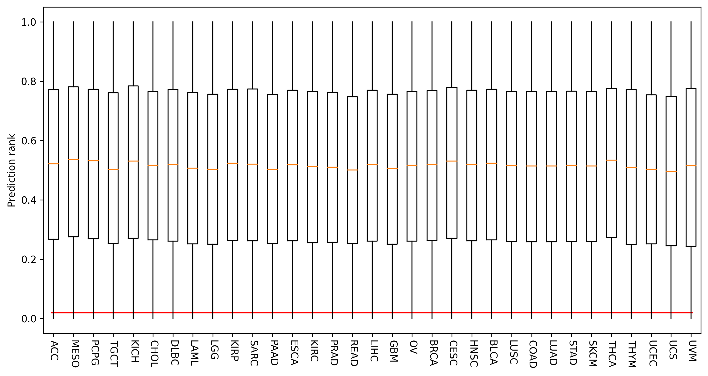

```{r , include=FALSE}
options(max.print = "120")
knitr::opts_chunk$set(echo = TRUE, comment = "#>", eval = TRUE, collapse = TRUE,cache = FALSE,warning = FALSE)
knitr::opts_knit$set(width = 120)
```

```{r lib, include=FALSE}
library(readr)
library(dplyr)
library(NeoEnrichment)
library(ggplot2)
library(ggprism)
library(ggpubr)
library(patchwork)
library(reticulate)
use_python(Sys.which("python"))
```


- [Immunotherapy](#immunotherapy)
- [Immunoediting](#immunoediting)

## Immunotherapy

To further validate TLimmuno2 and demonstrate the value of our model as a knowledge discovery tool, we evaluated the physiological relevance of TLimmuno2’s prediction. Most current cancer vaccine platforms preferentially screen candidate neoepitopes for vaccine production by selecting highly expressed candidate neoepitopes with high binding affinity to HLA alleles. However, despite rigorous candidate selection, many vaccine peptides do not elicit T-cell responses after vaccination. Therefore, we compare the performance of TLimmuno2 and NetMHCIIpan by using personalized melanoma neoepitopes with corresponding immune response data

```{python}
import pandas as pd
import numpy as np
import seaborn as sns
import matplotlib.pyplot as plt
import matplotlib as mpl
mpl.rcParams['pdf.fonttype'] = 42
mpl.rcParams['ps.fonttype'] = 42
plt.rcParams.update({'font.family':'Arial'})
from sklearn.metrics import accuracy_score, recall_score, f1_score, precision_score
```

```{python}
def IMM_process_rank(Data,peptide):
    sam_pep_ID = Data["pep_ID"].unique()
    res = []
    p_ID = []
    Data["length"] = Data["pep"].map(len)
    for a in sam_pep_ID:
        Mean = []    
        ID = Data[Data["pep_ID"] == a]
        for i in ID["HLA"].unique():
            Data_HLA = ID[ID["HLA"] == i]
            prediction = []
            for l in Data_HLA["length"].unique():
                Data_len = Data_HLA[Data_HLA["length"] == l]
                pre = Data_len["Rank"].min()
                prediction.append(pre)
            x_mean = np.min(prediction)
            Mean.append(x_mean)
        res.append(min(Mean))
        p_ID.append(a)
    result = pd.DataFrame({"pep_ID":p_ID,"prediction":res})
    result = result.merge(peptide,how = "inner",on = "pep_ID" )
    return result
def netMHCIIpan_process(result,allele,ori_sorted,peptide):
    #combine two type allele
    result = pd.merge(result,allele,left_on="allele",right_on="Allele Name")
    result_sorted = result.sort_values(by=["peptide","HLA"]).reset_index(drop = True)
    #combine with ori data
    result_combined = pd.merge(result_sorted,ori_sorted[["pep","pep_ID"]],left_on = "peptide",right_on ="pep")
    #result_combined["pep_length"] = result_combined["peptide"].map(len)
    sam_pep_ID = result_combined["pep_ID"].unique()
    res = []
    p_ID = []
    for a in sam_pep_ID:
        Mean = []
        ID = result_combined[result_combined["pep_ID"] == a]
        #get Mean of all splited pep and Max of all HLA
        for i in ID["Allele Name"].unique():
            Data_HLA = ID[ID["Allele Name"] == i]
            prediction = []
            for l in Data_HLA["pep_length"].unique():
                Data_len = Data_HLA[Data_HLA["pep_length"] == l]
                pre = Data_len["percentile_rank"].min()
                prediction.append(pre)
            x = np.min(prediction)
        res.append(np.min(x))
        p_ID.append(a) 
    final_result = pd.DataFrame({"pep_ID":p_ID,"prediction":res})
    final_result = final_result.merge(peptide,how = "inner",on = "pep_ID" )
    return final_result 
patient_id = ["O.1","O.2","O.3","O.4","O.5","O.6"]
DF15 = pd.read_csv("../data/DF15.csv")
```

```{python}
result_15 = pd.read_csv("../data/15mer_rank_result.csv")
peptide= pd.read_csv("../data/peptide.csv")
Rank_15mer = IMM_process_rank(result_15,peptide)
DF15_sorted = DF15.sort_values(by=["pep","HLA"]).reset_index(drop = True)
allele = pd.read_csv("../data/allele.csv")
netMHCIIpan_ba = pd.read_csv("../data/netMHCIIpan_15_mer_ba.csv")
netMHCIIpan_ba["pep_length"] = netMHCIIpan_ba["peptide"].map(len)
net_15mer_ba = netMHCIIpan_process(netMHCIIpan_ba,allele,DF15_sorted,peptide)
netMHCIIpan_el = pd.read_csv("../data/netMHCIIpan_15_mer_el.csv")
netMHCIIpan_el["pep_length"] = netMHCIIpan_el["peptide"].map(len)
net_15mer_el = netMHCIIpan_process(netMHCIIpan_el,allele,DF15_sorted,peptide)
ott_net_ba = net_15mer_ba[net_15mer_ba["Patient_ID"].map(lambda x : x in patient_id)]
ott_net_el = net_15mer_el[net_15mer_el["Patient_ID"].map(lambda x : x in patient_id)]
ott_imm = Rank_15mer[Rank_15mer["Patient_ID"].map(lambda x : x in patient_id)]
```

```{python}
def call_value(data,net = True):
  if net:
    preds = data["prediction"].map(lambda x : 1 if x <=2 else 0)
  else:
    preds = data["prediction"].map(lambda x : 1 if x <=0.02 else 0)
  trues = data["Immunogenicity"]
  acc = accuracy_score(trues, preds)
  p = precision_score(trues, preds)
  r = recall_score(trues, preds)
  f1= f1_score(trues, preds)
  
  return acc,p,r,f1
```

```{python}
#top20&top50
from collections import Counter
ott_imm_sorted = ott_imm.sort_values(by="prediction")
ott_net_el_sorted = ott_net_el.sort_values(by="prediction")
ott_net_ba_sorted = ott_net_ba.sort_values(by="prediction")
ott_imm_sorted["pre_label"] = ott_imm_sorted["prediction"].map(lambda x : 1 if x <=0.02 else 0)
ott_net_el_sorted["pre_label"] = ott_net_el_sorted["prediction"].map(lambda x : 1 if x <=2 else 0)
ott_net_ba_sorted["pre_label"] = ott_net_ba_sorted["prediction"].map(lambda x : 1 if x <=2 else 0)
def call_top(x):
  x20 = x[0:20]
  top20 = Counter(x20["Immunogenicity"] == x20["pre_label"])[True]
  x50 = x[0:50]
  top50 = Counter(x50["Immunogenicity"] == x50["pre_label"])[True]
  
  return top20,top50
imm20,imm50 = call_top(ott_imm_sorted)
net_ba20,net_ba50 = call_top(ott_net_ba_sorted)
net_el20,net_el50 = call_top(ott_net_el_sorted)
top20 = [imm20,net_ba20,net_el20]
top50 = [imm50,net_ba50,net_el50]
```

```{python}
imm = call_value(ott_imm,False)
net_ba = call_value(ott_net_ba)
net_el = call_value(ott_net_el)
data = pd.DataFrame([imm,net_ba,net_el], index = ["TLimmuno2","NetMHCIIpan_BA","NetMHCIIpan_EL"],columns = ["Accuracy","Precision","Recall","F1-score"])
data["Method"] = data.index
data = data.melt(id_vars = "Method")
fig,ax = plt.subplots(figsize = (6,4))
sns.barplot(x = "variable",y = "value", hue = "Method",data = data,palette = "Set2")
ax.set_xlabel("")
ax.set_ylabel("Score",fontsize = 14)
ax.spines["top"].set_visible(False)
ax.spines["right"].set_visible(False)
plt.savefig("../figure/neoantigen_vaccine.pdf",dpi = 300,transparent=True)
plt.show()
```

```{python}
data = pd.DataFrame([top20,top50], columns = ["TLimmuno2","netMHCIIpan_ba","netMHCIIpan_el"],index = ["Top20","Top50"])
data["Method"] = data.index
data = data.melt(id_vars = "Method")
fig,ax = plt.subplots(figsize = (3,4))
sns.barplot(x = "Method",y = "value", hue = "variable",data = data,palette = "Set2")
ax.set_xlabel("")
ax.get_legend().remove()
ax.set_ylabel("Immunogenic peptides",fontsize = 14)
ax.spines["top"].set_visible(False)
ax.spines["right"].set_visible(False)
plt.savefig("../figure/neoantigen_top20&50.pdf",dpi = 300,bbox_inches='tight',transparent=True)
plt.show()
```

As shown in figure, TLimmuno2 performs better than the binding affinity model in accuracy, recall and F1 score by using 2% rank as a cut-off. The TopK metric (K=20 or 50, the number of positive samples in the top K samples with the lowest predicted ranks) is also used to evaluate the performance of different models, and TLimmuno2 shows improved performance compared with netMHCIIpan BA in these TopK metrics.

## Immunoediting

The interactions between immune cells and tumor cells are reflected as immunoediting, which could mediate the negative selection of DNA alterations encoding high immunogenicity. The status of MHC class II neoantigen mediated negative selection in cancer evolution is still unknown. We next applied the TLimmuno2 to predict the immunogenicity of neopeptides arising from missense mutation in TCGA samples.

We then detect the immunoediting signals in TCGA samples by using the previously published CCF enrichment score (ESccf) method

we download 33 cancer type somatic mutation file form [ucsx xena](https://xenabrowser.net/datapages/), we focus on "MuTect2 Variant Aggregation and Masking". here the detail of dataprocess:

```{r TCGA-data}
#R
TCGA_data = read_csv("../data/cancer_type.csv")
DT::datatable(TCGA_data,rownames = FALSE)
```

1. from ```maf``` to ```mut_pep```:

```{python,eval =FALSE}
#python
#PBS_batch
import pandas as pd
import numpy as np
import os
import re
import sys
file = sys.argv[1]
maf_file_path =  "/public/slst/home/wanggsh/TCGA-process/Maf"
def maf2vcf(MAF_file,tumor_file_path):
    for i in MAF_file["Tumor_Sample_Barcode"].unique():
        split_maf_file = MAF_file[MAF_file["Tumor_Sample_Barcode"] == i]
        split_maf_file.to_csv("{0}/Tmp/{1}.maf".format(tumor_file_path,i),sep="\t",index=False)
        # maf2vcf comd
        comd1 ="""
        perl /public/home/liuxs/anaconda3/envs/neo/bin/maf2vcf.pl \
        --input-maf "{0}/Tmp/{1}.maf" \
        --output-dir {0}/VCF \
        --output-vcf {0}/VCF/{1}.vcf \
        --ref-fasta /public/home/liuxs/biodata/reference/genome/hg38/hg38.fa
        """.format(tumor_file_path,i)
        os.system(comd1)
def vcf2pep(tumor_file_path):
    for i in os.listdir("{0}/VCF".format(tumor_file_path)):
        print("Get pep from vcf in sample {0}".format(i))
        os.system("Rscript /public/slst/home/wanggsh/TCGA-process/vcf2pep.R {0}/VCF/{1} {0}/Pep/{1}.csv".format(tumor_file_path,i))
MAF_file = pd.read_table("{0}/{1}".format(maf_file_path,file),comment="#")
tumor_type = re.split("\.",file)[0]
file_path = "/public/slst/home/wanggsh/TCGA-process/Res/{0}".format(tumor_type)
os.system("mkdir {0}".format(file_path))
os.system("mkdir {0}/Tmp".format(file_path))
os.system("mkdir {0}/VCF".format(file_path))
print("maf to vcf in sample {0}".format(file))
maf2vcf(MAF_file,file_path)
os.system("rm {0}/VCF/*.tsv".format(file_path))
os.system("mkdir {0}/Pep".format(file_path))
vcf2pep(file_path)
```

here are ```vcf2pep.R``` script, we only choose missense mutation to get peptide sequence.

```{r,eval=FALSE}
#vcf2pep.R
#code from WuTao
rary(tidyverse)
library(stringr)
args = commandArgs(trailingOnly = TRUE)

print(args)
annovar_path = "/public/slst/home/wanggsh/biosoft/annovar"


vcf2annova <- function(annovar_path,vcf_path,out_file,
                      need_allsamples=TRUE,need_samples){

  need_allsamples <- match.arg(as.character(need_allsamples),choices = c("TRUE","FALSE"))

  if (need_allsamples){
    commond <- paste0(annovar_path,"/convert2annovar.pl -format vcf4 ",vcf_path," -outfile ",out_file," -allsample -withfreq")
    system(command = commond)
  }else{
    commond <- paste0(annovar_path,"/convert2annovar.pl -format vcf4 ",vcf_path," -outfile ",out_file," -allsample")
    system(command = commond)
    need_samples_file <- paste0("cat ",out_file,".",need_samples,".avinput >> ",out_file)
    system(need_samples_file)
  }
}
vcf2pep <- function(annovar_path,vcf_path,
                    genome_version=c("hg19","hg38"),need_allsamples=TRUE,need_samples,num_thread){
  need_allsamples <- match.arg(as.character(need_allsamples),choices = c("TRUE","FALSE"))
  genome_version <- match.arg(genome_version)
  temp_file <- tempfile()
  temp_dir <- tempdir()
  file.create(temp_file)
  vcf2annova(annovar_path = annovar_path,vcf_path = vcf_path,out_file = temp_file,need_allsamples = need_allsamples,
             need_samples = need_samples)

  mut <- read.table(temp_file)
  mut <- mut[,1:5]
  colnames(mut) <- c("chr","start","end","ref","alt")
  comm_annotate <- paste0(annovar_path,"/table_annovar.pl ",temp_file," ",annovar_path,"/humandb/",
                          " -build ",genome_version,
                          " --outfile ",temp_dir,"/myanno",
                          ' -protocol refGene -operation g  --codingarg "-includesnp -onlyAltering"',
                          " --thread ",num_thread)
  system(comm_annotate)

  dt <- seqinr::read.fasta(file = paste0(temp_dir,"/myanno.refGene.fa"),
                           seqtype = "AA",as.string = TRUE,whole.header = T)

  variants <- names(dt)[seq(2,length(dt),by=2)]
  variants <- variants[grepl("protein-altering",variants)]
  pos_alter <- stringr::str_extract_all(variants,"p[.].+ protein-altering") %>% gsub(" protein-altering","",.)
  cdna <- stringr::str_extract_all(variants,"c[.].+ p[.]") %>% gsub(" p[.]","",.)
  lines <- stringr::str_extract_all(variants,"line.+ NM_") %>% gsub(" NM_","",.) %>%
    gsub("line","",.) %>% as.numeric()
  ENST <- stringr::str_extract_all(variants,"line.+ NM_[0-9]+") %>% gsub("line.+ ","",.)##extract transcripts

  mut_need <- mut[lines,]
  pep_seq_mt <- dt[sapply(variants,function(x){which(names(dt)==x)}) %>% unname()] %>% as.character()
  pep_seq_wt <- dt[(sapply(variants,function(x){which(names(dt)==x)}) %>% unname())-1] %>% as.character()
  mut_need$seq_wt <- pep_seq_wt
  mut_need$seq_mt <- pep_seq_mt
  mut_need$pos_alter <- pos_alter
  mut_need$cdna <- cdna
  mut_need$transcript <- ENST
  files_exist <- c(list.files(temp_dir,pattern = gsub(paste0(temp_dir,"/"),"",temp_file),full.names = T),
                   list.files(temp_dir,pattern = "myanno",full.names = T))##remove all temp files
  file.remove(files_exist)
  return(mut_need)
}

extractSeq <- function(seq,pos,len,indel=FALSE){
  indel <- match.arg(as.character(indel),choices = c("TRUE","FALSE"))
  if (pos < len){
    ext_seq <- substr(seq,1,(pos+len-1))
  }else if ((nchar(seq)-pos)<(len-1)){
    ext_seq <- substr(seq,(pos-len+1),nchar(seq))
  }else{
    ext_seq <- substr(seq,(pos-len+1),(pos+len-1))
  }

  if (indel){
    if (pos < len){
      ext_seq <- substr(seq,1,nchar(seq))
    }else{
      ext_seq <- substr(seq,(pos-len+1),nchar(seq))
    }
  }
  return(ext_seq)
}
vcf2seq <- function(annovar_path,vcf_path,
                    genome_version=c("hg19","hg38"),need_allsamples=TRUE,need_samples,len,num_thread){

  pep <- vcf2pep(annovar_path = annovar_path,vcf_path = vcf_path,
                 genome_version = genome_version,need_allsamples = need_allsamples,
                 need_samples = need_samples,num_thread=num_thread)

  pep <- pep %>%
    dplyr::mutate(pos = stringr::str_extract(pos_alter,"[0-9]+") %>% as.numeric()) %>%
    dplyr::rowwise() %>%
    dplyr::mutate(indel=ifelse(ref != "-" & alt != "-" & nchar(ref) == nchar(alt),"FALSE","TRUE")) %>%
    as.data.frame()
  ext_seqs_mt <- mapply(extractSeq,seq=pep$seq_mt,pos=as.numeric(pep$pos),
                        len=as.numeric(len),indel=pep$indel) %>% unname()
  ext_seqs_wt <- mapply(extractSeq,seq=pep$seq_wt,pos=as.numeric(pep$pos),
                        len=as.numeric(len),indel=pep$indel) %>% unname()
  ##remove the last star
  a <-  substr(ext_seqs_mt,nchar(ext_seqs_mt),nchar(ext_seqs_mt))=="*"
  b <-  substr(ext_seqs_wt,nchar(ext_seqs_wt),nchar(ext_seqs_wt))=="*"
  ext_seqs_mt[a] <- gsub("\\*","",ext_seqs_mt[a])
  ext_seqs_wt[b] <- gsub("\\*","",ext_seqs_wt[b])

  pep$ext_seqs_wt <- ext_seqs_wt
  pep$ext_seqs_mt <- ext_seqs_mt
  return(pep)
}
#vcf_path = "/public/slst/home/wanggsh/TCGA-process/Res/TCGA_ACC/VCF/TCGA-OR-A5J1-01A-11D-A29I-10.vcf"
#pep_file = "/public/slst/home/wanggsh/TCGA-process/Res/TCGA_ACC/Pep/result.csv"
vcf_path = args[1]
pep_file = args[2]
tumor_sample_barcode = unlist(strsplit(vcf_path,split ="/"))
tumor_sample_barcode = tumor_sample_barcode[length(tumor_sample_barcode)]
tumor_sample_barcode = unlist(strsplit(tumor_sample_barcode,split ="\\."))[1]
pep <- vcf2seq(annovar_path = annovar_path,vcf_path=vcf_path,genome_version = "hg38",need_allsamples =TRUE,len = 15,num_thread=1)


pep = pep[pep$indel== FALSE,]
pep = select(pep,-c("seq_wt","seq_mt"))
pep$tumor_sample_barcode = tumor_sample_barcode
write_csv(pep,pep_file,col_names = FALSE)
```

2. split mutated peptides into 15mer subsequence:

```{python, eval = FALSE}
#python
#PBS
import pandas as pd
import os
import re
file_path = "/public/slst/home/wanggsh/TCGA-process/Res"
tumor_type = os.listdir(file_path)
colnames = ["chr","start","end","ref","alt","pos_alter","cdna","transcript","pos","indel","ext_seqs_wt","ext_seqs_mt","tumor_sample_barcode"]
def mer15(Pep):
    P = []
    Length = 15
    for i in range(len(Pep) - Length +1):
        pep = Pep[i:i+Length]
        P.append(pep)
    return P
for i in tumor_type:
    DF = pd.DataFrame()
    pep_file_path = "/public/slst/home/wanggsh/TCGA-process/Res/{0}/Pep".format(i)
    pep_file = os.listdir(pep_file_path)
    for x in pep_file:
        tumor_barcode = re.split("\.",x)[0]
        pep = pd.read_csv("{0}/{1}".format(pep_file_path,x),names = colnames)
        pep = pep[["chr","start","end","ref","alt","ext_seqs_mt","tumor_sample_barcode"]]
        pep = pep.drop_duplicates()
        pep["length"] = pep["ext_seqs_mt"].map(len)
        pep = pep.query("length >=15") 
        Pep15 = []
        Pep_num = []
        Chrom = []
        Start = []
        End = []
        Refer = []
        Alt = []
        pep = pep.reset_index(drop=True)
        for y in range(len(pep)):
            res = mer15(pep["ext_seqs_mt"][y])
            pep_num = ["Pep{0}".format(y+1)] *len(res)
            chrom = [pep["chr"][y]] *len(res)
            start = [pep["start"][y]] *len(res)
            end = [pep["end"][y]] *len(res)
            refer = [pep["ref"][y]] *len(res)
            alt = [pep["alt"][y]] *len(res)
            Pep15.extend(res)
            Pep_num.extend(pep_num)
            Chrom.extend(chrom)
            Start.extend(start)
            End.extend(end)
            Refer.extend(refer)
            Alt.extend(alt)
        df = pd.DataFrame({"chr":Chrom,"start":Start,"end":End,"ref":Refer,"alt":Alt,"ext_seqs_mt":Pep15,"Pep_num":Pep_num})
        df["tumor_sample_barcode"] = tumor_barcode
        DF = pd.concat([DF,df])
    print("{0} Finish".format(i))
    DF = DF.drop_duplicates()
    DF.to_csv("/public/slst/home/wanggsh/TCGA-process/mut_pep2/{0}_pep.csv".format(i))
```

3. predicte peptide score by using TLimmuno2. HLA typing data was downloaded from [Benchmarking HLA genotyping and clarifying HLA impact on survival in tumor immunotherapy](https://doi.org/10.1002/1878-0261.12895) study and transformed to the format required by the neoantigen prediction tools. we predicted HLA-DR immunogenicity score of mutated peptides' subsequence.

```{python, eval = FALSE}
#python
#PBS
import pandas as pd
import numpy as np
import tensorflow as tf
import sys
sys.path.append("/public/slst/home/wanggsh/Project/MHCII/utils")
from Blosum62 import blosum62
import os
import re
os.environ["CUDA_VISIBLE_DEVICES"]="-1" 
#load_model

#strategy = tf.distribute.MirroredStrategy() #use mutiple GPU
BA_model = tf.keras.models.load_model("/public/slst/home/wanggsh/Project/Saved_model/new_BA_model/model1")
BAmodel = tf.keras.models.Model(inputs = BA_model.input,outputs = BA_model.layers[-2].output)
IMM = tf.keras.models.load_model("/public/slst/home/wanggsh/Project/Saved_model/MHCII_immuno/model")
#mutant pep file

mut_pep_file_path ="/public/slst/home/wanggsh/TCGA-process/mut_pep2"

MHC_II = pd.read_csv("/public/slst/home/wanggsh/TCGA-process/TCGA-MHCII-allele.csv")
pseudo_seq = pd.read_table("/public/slst/home/wanggsh/Data/MHCII/pseudosequence.2016.all.X.dat",names=["hla","sequence"])
i = sys.argv[1]
tumor = re.sub("_pep.csv","",i)
print("{0} Start".format(tumor))
Data = pd.read_csv("{0}/{1}".format(mut_pep_file_path,i))
MHC_II_smal = MHC_II[MHC_II["project_id"] == tumor]
Data["Sample_Barcode"] = Data["tumor_sample_barcode"].map(lambda x : x[0:12])
Data = pd.merge(Data,MHC_II_smal[["Sample_Barcode","hla"]])
Data = pd.merge(Data,pseudo_seq)
Data["pep_blosum"] = Data["ext_seqs_mt"].apply(blosum62,args=(21,))
Data["MHC_blosum"] = Data["sequence"].apply(blosum62,args=(34,))
peptide = np.empty((len(Data),21,21))
for i in range(len(Data)):
    peptide[i] = Data["pep_blosum"][i].reshape((21,21))

MHC = np.empty((len(Data),34,21))
for i in range(len(Data)):
    MHC[i] = Data["MHC_blosum"][i].reshape((34,21))

BA = BAmodel.predict([peptide,MHC])
IMM_result = IMM.predict([peptide,MHC,BA])
Data["prediction"] = IMM_result
Data.pop("Unnamed: 0")
Data.pop("sequence")
Data.pop("pep_blosum")
Data.pop("MHC_blosum")
Data.to_csv("/public/slst/home/wanggsh/TCGA-process/Prediction/IMM2/{0}.csv".format(tumor))
print("{0} Finish".format(tumor))
```

4.Background peptide predict

```{python, eval = FALSE}
#PBS
#python
import pandas as pd
import sys
import numpy as np
sys.path.append("/public/slst/home/wanggsh/Project/MHCII/utils")
from Blosum62 import blosum62
import os
#os.environ["CUDA_VISIBLE_DEVICES"]="-1" 
import tensorflow as tf
BA_model = tf.keras.models.load_model("/public/slst/home/wanggsh/Project/Saved_model/new_BA_model/model1")
BAmodel = tf.keras.models.Model(inputs = BA_model.input,outputs = BA_model.layers[-2].output)
IMM = tf.keras.models.load_model("/public/slst/home/wanggsh/Project/Saved_model/MHCII_immuno/model")
TCGA_allele = pd.read_csv("/public/slst/home/wanggsh/TCGA-process/TCGA-MHCII-allele.csv")
pseudo_seq2 = pd.read_feather("/public/slst/home/wanggsh/Data/pseudo_blosum62.feather")
IMM_bg_pep = pd.read_csv("/public/slst/home/wanggsh/Data/MHCII_immuno/IMM_bg_pep.csv")
IMM_bg_pep["pep_blosum"] = IMM_bg_pep["pep"].apply(blosum62,args=(21,))
inteset = np.intersect1d(TCGA_allele["hla"].values,pseudo_seq2["MHC"].values)
#np.setdiff1d(TCGA_allele["hla"].values,pseudo_seq2["MHC"].values)
for i in inteset:
    DF = pd.DataFrame()
    IMM_bg_pep["MHC"] = i
    x = pd.merge(IMM_bg_pep,pseudo_seq2[["MHC","MHC_blosum"]])
    DF = pd.concat([DF,x])
    peptide = np.empty((len(DF),21,21))
    for z in range(len(DF)):
        peptide[z] = DF["pep_blosum"][z].reshape((21,21))
    MHC = np.empty((len(DF),34,21))
    for z in range(len(DF)):
        MHC[z] = x["MHC_blosum"][z].reshape((34,21))
    BA = BAmodel.predict([peptide,MHC])
    IMM_result = IMM.predict([peptide,MHC,BA])
    DF["Prediction"] = IMM_result
    DF = DF.drop(["Unnamed: 0","pep_blosum","MHC_blosum"],axis=1)
    DF.to_csv("/public/slst/home/wanggsh/TCGA-process/back_ground_pep/{0}.csv".format(i))
```

5.Ranking: use background peptides to do rank

```{python eval = FALSE}
#PBS_batch
#python
import pandas as pd
import numpy as np
import tensorflow as tf
import sys
sys.path.append("/public/slst/home/wanggsh/Project/MHCII/utils")
from Blosum62 import blosum62
import os
import re
os.environ["CUDA_VISIBLE_DEVICES"]="-1" 

IMM_resul_path = "/public/slst/home/wanggsh/TCGA-process/Prediction/IMM"
background_path = "/public/slst/home/wanggsh/TCGA-process/back_ground_pep"
file = os.listdir(IMM_resul_path)
arg = sys.argv[1]
res = pd.read_csv("{}/{}".format(IMM_resul_path,arg))
DF = pd.DataFrame()
for y in res["hla"].unique():
    res_all = res[res["hla"]==y]
    back_ground = pd.read_csv("{}/{}.csv".format(background_path,y))
    back_ground = back_ground["Prediction"].values.tolist()
    Rank = []
    for I in res_all["prediction"].values:
        back_ground.append(I)
        rank = 1-(sorted(back_ground).index(back_ground[-1])+1)/90001
        Rank.append(rank)
        back_ground.pop()
    res_all["Rank"] = Rank
    DF = pd.concat([DF,res_all])
DF.to_csv("/public/slst/home/wanggsh/TCGA-process/Prediction/IMM_rank/{0}_rank.csv".format(arg))
```

```{python, eval = FALSE}
#python
#PBS
import pandas as pd
import matplotlib.pyplot as plt
import os
import re
import numpy as np

file_path = "/public/slst/home/wanggsh/TCGA-process/Prediction/IMM_rank2"
file = os.listdir(file_path)

Barcode = []
Rank = []
for i in file:
    Data = pd.read_csv("{}/{}".format(file_path,i))
    tumor = re.split(".csv_rank.csv",i)[0]
    Barcode.append(tumor)
    Rank.append(Data["Rank"])
Rank = np.array(Rank)
np.save("/public/slst/home/wanggsh/TCGA-process/Prediction/TCGA_rank.npy",Rank)
barcode = []
for i in Barcode:
    x = re.split("TCGA_",i)[1]
    barcode.append(x)
fig,axs = plt.subplots(figsize = (12,6))
plt.boxplot(Rank,labels=barcode,showcaps=False)
plt.xticks(rotation = 270)
plt.hlines(0.02,colors="red",xmin=0.9,xmax=33.1)
plt.ylabel("Prediction rank")
plt.savefig("/public/slst/home/wanggsh/TCGA-process/TCGA-rank.png",dpi = 300,bbox_inches='tight',transparent=True)

Barcode = []
Prediction = []
for i in file:
    Data = pd.read_csv("{}/{}".format(file_path,i))
    tumor = re.split(".csv_rank.csv",i)[0]
    Barcode.append(tumor)
    Prediction.append(Data["prediction"])
Prediction = np.array(Prediction)
np.save("/public/slst/home/wanggsh/TCGA-process/Prediction/TCGA_prediction.npy",Prediction)

fig,axs = plt.subplots(figsize = (12,6))
plt.boxplot(Prediction,labels=barcode,flierprops = dict(marker='o', markersize=2,linestyle='none'),showcaps=False,showfliers = False)
plt.xticks(rotation = 270)
plt.ylabel("Prediction score")
plt.savefig("/public/slst/home/wanggsh/TCGA-process/TCGA-prediction.png",dpi = 300,bbox_inches='tight',transparent=True)

fig,axs = plt.subplots(figsize = (12,6))
plt.boxplot(Prediction,labels=barcode,flierprops = dict(marker='o', markersize=2,linestyle='none'),showcaps=False)
plt.xticks(rotation = 270)
plt.ylabel("Prediction score")
plt.savefig("/public/slst/home/wanggsh/TCGA-process/TCGA-prediction-with-Discretevalues.png",dpi = 300,bbox_inches='tight',transparent=True)
```




By comparing prediction score and rank value in each TCGA samples, we found that most scores are less than 0.1 and the median rank value is around 0.5. It suggest that most mutant peptides are non-immunogenic.

#### Compare the different of MHCI BA ,MHCII BA and Immunogenicity

To evaluate the extent to which the TLimmuno2 learned a signal that is also learned by the binding affinity predictor, we measured the Pearson correlation between immunogenicity rank and binding affinity rank.

1. combine MHC I binding affinity rank value and MHC II immunogenicity rank value

```{r,eval= FALSE}
setwd("~/Project/MHCII/Data/TCGA-MHC-I/")
files <- list.files("/home/data/NeoPredPipe_results/",full.names = T,pattern = "batch")
final_result = tibble()
for (i in 1:100) {
  tt <- data.table::fread(files[i],sep = "\t",fill = TRUE)
  tt <- tt %>% dplyr::select(c(1,4:7,11,12,22,24))
  colnames(tt) <- c("sample","chr","position","ref","alt","hla","pep","rank_el","rank_ba")
  #tt$hla <-str_replace(tt$hla,"\\:","")
  sample = c()
  chr = c()
  pos = c()
  Rank = c()
  HLA = c()
  for (x in unique(tt$sample)){
    tt_sample = tt[tt$sample == x, ]
    for (y in unique(tt_sample$chr)){
      tt_chr = tt_sample[tt_sample$chr == y,]
      for (z in unique(tt_chr$position)){
        tt_pos = tt_chr[tt_chr$position == z,]
        prediction = c()
        for (h in unique(tt_chr$hla)){
          tt_hla = tt_pos[tt_pos$hla == h,]
          pre = min(tt_hla$rank_ba)
          prediction = c(prediction,pre)
        }
        rank = min(prediction)
        sample = c(sample,x)
        chr = c(chr,y)
        pos = c(pos,z)
        HLA = c(HLA,h)
        Rank = c(Rank,rank)
      }
    }
  }
  res = tibble(sample,chr,pos,HLA,Rank)
  final_result = rbind(final_result,res)
  message("complete ", i)
}
saveRDS(final_result,"MHCI_BA.rds")
```


```{r, eval=FALSE}
#MHCII_BA
files <- list.files("~/Project/MHCII/Data/TCGA/neoantigen_es",full.names = T)
res <- lapply(files,
                function(x){
                  read_csv(x)
                })
MHC_II_imm <- bind_rows(res)
files <- list.files("~/Project/MHCII/Data/TCGA/net_neoantigen_es",full.names = T)

res <- lapply(files,
              function(x){
                read_csv(x)
              })
MHC_II_BA <- bind_rows(res)
MHC_I_BA <- readRDS("MHCI_BA.rds")
MHC_I_BA$sample <- str_sub(MHC_I_BA$sample,end = 12)
MHC_I_BA <- MHC_I_BA %>% select(sample,chr,pos,Rank)%>% rename("MHCI_BA_Rank" = "Rank") %>% rename("sample_barcode" = "sample")
MHC_II_imm <- MHC_II_imm %>% select(Sample_Barcode,chr,start,Result)
colnames(MHC_II_imm) <- c("sample_barcode","chr","pos","MHCII_IMM_Rank")
MHC_II_BA <- MHC_II_BA %>% select(sample,chr,start,Result)
colnames(MHC_II_BA) <- c("sample_barcode","chr","pos","MHCII_BA_Rank")
MHCIBA_IMM <- left_join(MHC_I_BA,MHC_II_imm)
MHCIIBA_IMM <- left_join(MHC_II_BA,MHC_II_imm)
MHCIIBA_IMM$MHCII_BA_Rank <- MHCIIBA_IMM$MHCII_BA_Rank/100
saveRDS(MHCIBA_IMM,"MHCIBA_IMM.rds")
saveRDS(MHCIIBA_IMM,"MHCIIBA_IMM.rds")
```

2. Calculating the Pearson correlation coefficient between Binding affinity and immunogenicity.

```{r}
MHCIBA_IMM <- readRDS("../data/MHCIBA_IMM.rds")
MHCIIBA_IMM <- readRDS("../data/MHCIIBA_IMM.rds")
MHCIBA_IMM <- na.omit(MHCIBA_IMM)
MHCIIBA_IMM <- na.omit(MHCIIBA_IMM)
MHCIBA_IMM <- rename(MHCIBA_IMM,BA_Rank = MHCI_BA_Rank)
MHCIIBA_IMM <- rename(MHCIIBA_IMM,BA_Rank = MHCII_BA_Rank)
split_sample <- function(data) {
  r = c()
  p = c()
  for (i in unique(data$sample_barcode)) {
    sam <- data[data$sample_barcode == i,]
    if (nrow(sam)<=2) {
      next
    }
    
    cor_test = cor.test(sam$BA_Rank/100,sam$IMM_Rank)
    r <- c(r,cor_test$estimate)
    p <- c(p,cor_test$p.value)
  }
  r2 <- r*r
  
  padj <- p.adjust(p, method = "BH")
  x <- tibble(r,p,r2,padj)
  return(x)
}

MHCI <- split_sample(MHCIBA_IMM)
MHCI$Type <- "MHCI"
median(MHCI$r2)
MHCII <- split_sample(MHCIIBA_IMM)
MHCII$Type <- "MHCII"
median(MHCII$r2)
result <- rbind(MHCI,MHCII)
ggplot(result,aes(r,fill = Type)) + 
  geom_density(alpha = 0.6) + theme_bw() + theme(axis.line = element_line(colour = "black"),
                                             panel.grid.major = element_blank(),
                                             panel.grid.minor = element_blank(),
                                             panel.border = element_blank(),
                                             panel.background = element_blank())
ggsave("../figure/BA_IMM_r.pdf",dpi = 300,width = 6,height = 6)
ggplot(result,aes(r2,fill = Type)) + 
  geom_density(alpha = 0.6) + theme_bw()+ theme(axis.line = element_line(colour = "black"),
                                 panel.grid.major = element_blank(),
                                 panel.grid.minor = element_blank(),
                                 panel.border = element_blank(),
                                 panel.background = element_blank())+xlab(bquote(R^2))

ggsave("../figure/BA_IMM_r2.pdf",dpi = 300,width = 6,height = 6)
ggplot(result,aes(padj,fill = Type)) + 
  geom_density(alpha = 0.6) + theme_bw()+ theme(axis.line = element_line(colour = "black"),
                                                panel.grid.major = element_blank(),
                                                panel.grid.minor = element_blank(),
                                                panel.border = element_blank(),
                                                panel.background = element_blank())
ggsave("../figure/BA_IMM_padj.pdf",dpi = 300,width = 6,height = 6)
```

The correlations were positive, significant but low in magnitude, median Pearson r2 = 0.0968 in the compare between MHC I binding affinity rank and MHC II immunogenicity rank; and median Pearson r2 = 0.2057 in the compare between MHC II binding affinity rank and MHC II immunogenicity rank . Overall, this analysis suggested that the TLimmuno2 is at least partially non-redundant with the binding affinity predictor.

### immunoediting signal detect

We analyzed all neoepitopes in TCGA using TLimmuno2 and set cutoff to 2% to obtain neoantigens.

```{python, eval = FALSE}
#PBS_batch
#python
import os
import pandas as pd
import re
file_path3 = "/public/slst/home/wanggsh/TCGA-process/Prediction/IMM_rank2"
def get_neoantigen(Data):
    DF = pd.DataFrame()
    for i in Data["Sample_Barcode"].unique():
        Data_sample = Data[Data["Sample_Barcode"] == i]
        for x in  Data_sample["chr"].unique():
            Data_chr = Data_sample[Data_sample["chr"] == x]
            for start in Data_chr["start"].unique():
                Data_str = Data_chr[Data_chr["start"] == start]
                prediction = []
                for y in Data_str["hla"].unique():
                    Data_hla = Data_str[Data_str["hla"] == y]
                    pre = Data_hla["Rank"].min() 
                    prediction.append(pre)
                Data_str["Result"] = min(prediction)
                Data_final = Data_str[["tumor_sample_barcode","Sample_Barcode","chr","start","end","ref","alt","Result"]]
                Data_final = Data_final.drop_duplicates()
                DF = pd.concat([DF,Data_final])
    DF["label"] = DF["Result"].map(lambda x : 1 if x <0.02 else 0) 
    return DF
file = os.listdir(file_path3)
for i in file:
    tumor = re.split(".csv_rank.csv",i)[0]
    Data = pd.read_csv("{}/{}".format(file_path3,i))
    result = get_neoantigen(Data)
    result.to_csv("".format(tumor))
```

Then we can calculate and compare the median actual CCF-ES with median simulation CCF-ES in pan-cancer and cancer-type:

```{r,eval=FALSE}
#R
ccf <- readRDS("all_mut_mis_ccf.rds")
files <- list.files("~/Project/MHCII/Data/TCGA/neoantigen_es/",full.names = TRUE)
res <- lapply(files,
              function(x){
                read.csv(x) %>% select(-X)
              })
mut_all <- bind_rows(res)
saveRDS(mut_all,file = "mut_all.rds")

mut_all <- mut_all %>%
  mutate(index=paste(substr(tumor_sample_barcode,1,16),
                     chr,start,ref,alt,sep = ":")) %>%
  select(index,Result,label)
all_mut_ccf <- inner_join(
  mut_all,
  ccf %>% select(-sample),
  by="index"
)
all_mut_ccf <- all_mut_ccf[!duplicated(all_mut_ccf$index),] 
all_mut_ccf$sample <- substr(all_mut_ccf$index,1,16)
all_mut_ccf <- all_mut_ccf %>% rename(gene = Hugo_Symbol)
TPM_log2 <- data.table::fread("tcga_RSEM_gene_tpm.gz")  #too large,not include
mapping <- data.table::fread("mapping_probe")
mapping <- mapping[,1:2]
TPM_log2_mapping <- left_join(TPM_log2 %>% rename(id=sample),mapping) %>%
  select(id,gene,everything())###log2(tpm+0.001)
TPM_log2_mapping <- as.data.frame(TPM_log2_mapping)
tpm_trans <- TPM_log2_mapping
tpm_trans[,3:ncol(tpm_trans)] <- apply(TPM_log2_mapping[,3:ncol(TPM_log2_mapping)],2,
                                       function(x){(2^x) - 0.001})
saveRDS(tpm_trans,file = "tpm_trans.rds")
tpm <- readRDS("tpm_trans.rds")
tpm <- tpm[!duplicated(tpm$gene),]

all_mut_ccf$tpm_exp <- mapply(function(sample,gene){
  tpm[tpm$gene==gene,substr(sample,1,15)]
},all_mut_ccf$sample,all_mut_ccf$gene)

all_mut_ccf_tpm <- all_mut_ccf %>%
  filter(lengths(tpm_exp)!=0)

all_mut_ccf_tpm$tpm_exp <- as.numeric(all_mut_ccf_tpm$tpm_exp)

all_mut_ccf_tpm <- all_mut_ccf_tpm %>%
  mutate(neo=ifelse(label==1 & tpm_exp>1,"neo","not_neo"))   #neo antigen& log expression >1

saveRDS(all_mut_ccf_tpm,file = "mut_ccf_tpm_neo.rds")
```

```{r, eval= FALSE}
cal_nes_warp <- function(dt){
  results_ccf <- vector("list",length = length(unique(dt$sample)))
  names(results_ccf) <- unique(dt$sample)
  
  cl <- makeCluster(getOption("cl.cores", 15),type="FORK")
  results_ccf <- parSapply(cl=cl,names(results_ccf),
                           function(x){
                             data <- dt %>% filter(sample == x)
                             a <- NeoEnrichment::cal_nes_new_test(dt = data,
                                                                  sample_counts = 1000,
                                                                  need_p = FALSE)
                             return(a)
                           },simplify = FALSE)
  stopCluster(cl)
  results_ccf <- Filter(function(x){length(x)>1},results_ccf)
  pancancer_nes_ccf <- bind_rows(results_ccf)
  return(pancancer_nes_ccf)
}  #ES score

all_mut_ccf <- readRDS("../data/30_mut_ccf_tpm_neo.rds")
all_mut_ccf <- all_mut_ccf %>%
  rename(ccf=ccf_hat) %>%
  mutate(neo=ifelse(neo=="neo","yes","no"))

samples_has_subclonal <- all_mut_ccf %>%
  filter(ccf<0.6) %>%
  select(sample) %>%
  distinct(sample)   

all_mut_ccf  %>%
  filter(sample %in% samples_has_subclonal$sample) %>%
  group_by(sample) %>%
  summarise(c_n=sum(neo=="yes"),c_m=sum(neo=="no")) %>% filter(c_n>=1 & c_m >=1) -> summ

driver_mutations <- readRDS("../data/driver_mutations.rds")
#reduce driver mutation 
all_mut_ccf <- all_mut_ccf %>%
  mutate(gene_protein_change=paste(gene,Protein_Change,sep = "-"))
driver_mutations <- driver_mutations %>%
  mutate(gene_protein_change=paste(gene,protein_change,sep = "-"))

all_mut_ccf <- all_mut_ccf %>%
  mutate(is_driver=ifelse(gene_protein_change %in% driver_mutations$gene_protein_change,"yes","no"))

sum(all_mut_ccf$is_driver=="yes" & all_mut_ccf$neo=="yes") / sum(all_mut_ccf$neo=="yes")##0.01618271

all_mut_ccf %>% group_by(sample) %>%
  summarise(inter_gene=intersect(gene[neo=="yes"],
                                 gene[is_driver=="yes"])) -> aaa##701 samples
all_mut_ccf <- all_mut_ccf %>%
  mutate(sample_neo_index=paste(sample,neo,gene,sep = ","))
aaa <- aaa %>% mutate(sample_neo_index=paste(sample,"yes",inter_gene,sep = ","))

all_mut_ccf %>%
  mutate(in_aaa = ifelse(sample_neo_index %in% aaa$sample_neo_index,"yes","no")) %>%
  group_by(sample) %>%
  summarise(need_sample=ifelse(any(in_aaa=="yes"),"no","yes")) %>%
  filter(need_sample=="yes") -> summ2
need_samples <- intersect(samples_has_subclonal$sample,summ2$sample)
all_mut_ccf %>% filter(!is.na(ccf)) %>%
  filter(sample %in% need_samples) %>%
  group_by(sample) %>%
  summarise(c_n=sum(neo=="yes"),c_m=sum(neo=="no")) %>% filter(c_n>=1 & c_m >=1) -> summ
neo_missense <- all_mut_ccf %>% filter(sample %in% summ$sample)
neo_missense <- neo_missense %>% select(sample,neo,ccf) %>% filter(!is.na(ccf))

library(parallel)
neo_nes <- cal_nes_warp(neo_missense)
saveRDS(neo_nes,file = "../data/30_neo_es.rds")
```

```{r simulation,eval = FALSE}
#R
neo_nes <- readRDS("../data/30_neo_es.rds")
all_mut_ccf <- readRDS("../data/30_mut_ccf_tpm_neo.rds")
all_mut_ccf <- all_mut_ccf %>%
  rename(ccf=ccf_hat) %>%
  mutate(neo=ifelse(neo=="neo","yes","no"))
neo_missense <- all_mut_ccf %>%
  filter(sample %in% neo_nes$sample)
neo_missense <- neo_missense %>%
  select(sample,neo,ccf) %>%
  filter(!is.na(ccf))

cal_nes_warp <- function(dt){
  results_ccf <- vector("list",length = length(unique(dt$sample)))
  names(results_ccf) <- unique(dt$sample)
  
  cl <- makeCluster(getOption("cl.cores", 15),type="FORK")
  results_ccf <- parSapply(cl=cl,names(results_ccf),
                           function(x){
                             data <- dt %>% filter(sample == x)
                             a <- NeoEnrichment::cal_nes_new_test(dt = data,
                                                                  sample_counts = 1000,
                                                                  need_p = FALSE)
                             return(a)
                           },simplify = FALSE)
  stopCluster(cl)
  results_ccf <- Filter(function(x){length(x)>1},results_ccf)
  pancancer_nes_ccf <- bind_rows(results_ccf)
  return(pancancer_nes_ccf)
}
res <- vector("list",2000)
for (i in 1:2000){
  neo_missense_sim <- neo_missense %>%
    group_by(sample) %>%
    mutate(neo_sim=sample(neo,length(neo))) %>%
    ungroup()
  neo_missense_sim <- neo_missense_sim %>%
    select(-neo) %>%
    rename(neo=neo_sim)
  neo_nes_sim <- cal_nes_warp(neo_missense_sim)
  neo_nes_sim$sim_num <- i
  res[[i]] <- neo_nes_sim
  print(paste0("Complete ",i," sim. "))
}
saveRDS(res,file = "30_sim_2000_not_filter_driver.rds")

neo_nes <- readRDS("30_neo_es.rds")
sim_all <- readRDS("30_sim_2000_not_filter_driver.rds")
sim_all <- bind_rows(sim_all)
sim_all$cancer <- get_cancer_type(sim_all$sample,parallel = TRUE,cores = 20)
saveRDS(sim_all,file = "30_sim_add_cancer.rds")
```

```{r plt_fig}
#R
neo_nes <- readRDS("../data/neo_es.rds")
sim_all <- readRDS("../data/sim_add_cancer.rds")
sim_all %>%
  group_by(cancer,sim_num) %>%
  summarise(median_es=median(es)) -> summ2
neo_nes$cancer <- get_cancer_type(neo_nes$sample)
neo_nes_summ <- neo_nes %>%
  group_by(cancer) %>% summarise(median_es=median(es))
sim_all %>%
  group_by(sim_num) %>%
  summarise(median_es=median(es)) -> summ
p <- WVPlots::ShadedDensity(frame = summ,
                            xvar = "median_es",
                            threshold = median(neo_nes$es),
                            title = "",
                            tail = "left")

p$layers[[1]]$aes_params$colour <- "red"
p$layers[[1]]$aes_params$size <- 1
p$layers[[2]]$aes_params$fill <- "blue"     #geom_ribbon
p$layers[[3]]$aes_params$colour <- "black"
p$layers[[3]]$aes_params$size <- 1
#p$layers[[4]]$aes_params$label <- "Actual median ES" #geom_text
p1 <- p + labs(x="Simulation median es")+
  theme_prism()
p1
ggsave("../figure/null_dis.pdf")
##cancer type
neo_nes_summ <- neo_nes_summ %>%
  rowwise() %>%
  mutate(p=mean(summ2$median_es[summ2$cancer==cancer] <= median_es))
get_f1 <- function(dt,pancancer_p,dt2,median_es){
  p1 <- ggplot(data=dt,aes(x=1,y=es))+
    geom_violin(alpha=0.7,width=0.5)+
    geom_boxplot(width=0.2)+
    theme_prism()+
    labs(x=paste0("median es = ",round(median_es,digits = 3),"\n n = ",nrow(dt)),y = "ESccf",size=5)+
    theme(axis.ticks.x = element_blank(),
          axis.text.x = element_blank())+
    theme(text = element_text(size = 10))+
    annotate(geom="text", x=1, y=1.1, label=paste0("p = ",pancancer_p),
             color="red",size=4)
  dt$cancer <- get_cancer_type(dt$sample)
  dt %>% group_by(cancer) %>%
    summarise(median_est=median(es),c=n()) %>%
    arrange(median_est) %>%
    mutate(label=paste0(cancer,"\n(n=",c,")"))-> summ1
  summ1 <- left_join(summ1,dt2 %>% select(cancer,p))
  summ1$p <- signif(summ1$p,digits = 1)
  summ1 <- summ1 %>%
    mutate(sig=case_when(
      p <= 0.05 & p > 0.01 ~ "*",
      p < 0.01 ~ "**",
      TRUE ~ "ns"
    ))
  dt <- left_join(dt,summ1)
  dt$label <- factor(dt$label,levels = summ1$label)
  df2 <- data.frame(x = 1:nrow(summ1), y = 1.1, family = summ1$sig)
  p2 <- ggplot(data=dt,aes(x=label,y=es))+
    geom_boxplot()+
    theme_prism()+
    theme(axis.title.x = element_blank())+
    theme(axis.text.x = element_text(angle = 45,vjust = 1, hjust = 1))+
    theme(text = element_text(size = 7))+
    geom_text(data=df2,aes(x=x,y=y,label = family))+
    geom_hline(yintercept=0,
               color = "red", size=1)+labs(y = "")
  p3 <- p1 + p2 + plot_layout(widths = c(1, 8))
}

p2 <- get_f1(neo_nes,pancancer_p = "< 0.0005",
             dt2 = neo_nes_summ,median_es = median(neo_nes$es))
p2
ggsave("../figure/immuno_edit.pdf",width = 12,height = 5,dpi = 300)
```

we also use 30% cutoff to define neoantigen and calculate ESccf score: 

```{r}
#R
neo_nes <- readRDS("../data/30_neo_es.rds")
sim_all <- readRDS("../data/30_sim_add_cancer.rds")
sim_all %>%
  group_by(cancer,sim_num) %>%
  summarise(median_es=median(es)) -> summ2
neo_nes$cancer <- get_cancer_type(neo_nes$sample)
neo_nes_summ <- neo_nes %>%
  group_by(cancer) %>% summarise(median_es=median(es))
sim_all %>%
  group_by(sim_num) %>%
  summarise(median_es=median(es)) -> summ
p <- WVPlots::ShadedDensity(frame = summ,
                            xvar = "median_es",
                            threshold = median(neo_nes$es),
                            title = "",
                            tail = "left")

p$layers[[1]]$aes_params$colour <- "red"
p$layers[[1]]$aes_params$size <- 1
p$layers[[2]]$aes_params$fill <- "blue"     #geom_ribbon
p$layers[[3]]$aes_params$colour <- "black"
p$layers[[3]]$aes_params$size <- 1
#p$layers[[4]]$aes_params$label <- "Actual median ES" #geom_text
p1 <- p + labs(x="Simulation median es")+
  theme_prism()
p1
ggsave("../figure/null_dis_30.pdf")
##cancer type
neo_nes_summ <- neo_nes_summ %>%
  rowwise() %>%
  mutate(p=mean(summ2$median_es[summ2$cancer==cancer] <= median_es))
get_f1 <- function(dt,pancancer_p,dt2,median_es){
  p1 <- ggplot(data=dt,aes(x=1,y=es))+
    geom_violin(alpha=0.7,width=0.5)+
    geom_boxplot(width=0.2)+
    theme_prism()+
    labs(x=paste0("median es = ",round(median_es,digits = 3),"\n n = ",nrow(dt)),y = "ESccf",size=5)+
    theme(axis.ticks.x = element_blank(),
          axis.text.x = element_blank())+
    theme(text = element_text(size = 10))+
    annotate(geom="text", x=1, y=1.1, label=paste0("p = ",pancancer_p),
             color="red",size=4)
  dt$cancer <- get_cancer_type(dt$sample)
  dt %>% group_by(cancer) %>%
    summarise(median_est=median(es),c=n()) %>%
    arrange(median_est) %>%
    mutate(label=paste0(cancer,"\n(n=",c,")"))-> summ1
  summ1 <- left_join(summ1,dt2 %>% select(cancer,p))
  summ1$p <- signif(summ1$p,digits = 1)
  summ1 <- summ1 %>%
    mutate(sig=case_when(
      p <= 0.05 & p > 0.01 ~ "*",
      p < 0.01 ~ "**",
      TRUE ~ "ns"
    ))
  dt <- left_join(dt,summ1)
  dt$label <- factor(dt$label,levels = summ1$label)
  df2 <- data.frame(x = 1:nrow(summ1), y = 1.1, family = summ1$sig)
  p2 <- ggplot(data=dt,aes(x=label,y=es))+
    geom_boxplot()+
    theme_prism()+
    theme(axis.title.x = element_blank())+
    theme(axis.text.x = element_text(angle = 45,vjust = 1, hjust = 1))+
    theme(text = element_text(size = 7))+
    geom_text(data=df2,aes(x=x,y=y,label = family))+
    geom_hline(yintercept=0,
               color = "red", size=1)+labs(y = "")
  p3 <- p1 + p2 + plot_layout(widths = c(1, 8))
}

p2 <- get_f1(neo_nes,pancancer_p = "0.14",
             dt2 = neo_nes_summ,median_es = median(neo_nes$es))
p2
ggsave("../figure/immuno_edit_30.pdf",width = 12,height = 5,dpi = 300)
```

In TCGA pan-cancer cohort, when samples with antigenic and driver mutations lying on the same gene are removed, the observed median ESCCF is -0.024 (n = 5,524, P-value < 0.0005). By comparing simulated median ES distribution, several cancer types including adrenocortical carcinoma (ACC), Thymoma (THYM), Esophageal carcinoma (ESCA), Cervical squamous cell carcinoma and endocervical adenocarcinoma (CESC), Cervical squamous cell carcinoma and endocervical adenocarcinoma (LUAD) show significant low ESCCF values

```{r}
sim_all <- readRDS("../data/net_sim_add_cancer.rds")
neo_nes <- readRDS("../data/net_neo_es.rds")
sim_all %>%
  group_by(cancer,sim_num) %>%
  summarise(median_es=median(es)) -> summ2
#> `summarise()` has grouped output by 'cancer'. You can override using the
#> `.groups` argument.
neo_nes$cancer <- get_cancer_type(neo_nes$sample)
neo_nes_summ <- neo_nes %>%
  group_by(cancer) %>% summarise(median_es=median(es))
sim_all %>%
  group_by(sim_num) %>%
  summarise(median_es=median(es)) -> summ
p <- WVPlots::ShadedDensity(frame = summ,
                            xvar = "median_es",
                            threshold = median(neo_nes$es),
                            title = "",
                            tail = "left")

p$layers[[1]]$aes_params$colour <- "red"
p$layers[[1]]$aes_params$size <- 1
p$layers[[2]]$aes_params$fill <- "blue"     #geom_ribbon
p$layers[[3]]$aes_params$colour <- "black"
p$layers[[3]]$aes_params$size <- 1
#p$layers[[4]]$aes_params$label <- "Actual median ES" #geom_text
p1 <- p + labs(x="Simulation median es")+
  theme_prism()
p1
ggsave("../figure/net_null_dis.pdf")
##cancer type
neo_nes_summ <- neo_nes_summ %>%
  rowwise() %>%
  mutate(p=mean(summ2$median_es[summ2$cancer==cancer] <= median_es))
get_f1 <- function(dt,pancancer_p,dt2,median_es){
  p1 <- ggplot(data=dt,aes(x=1,y=es))+
    geom_violin(alpha=0.7,width=0.5)+
    geom_boxplot(width=0.2)+
    theme_prism()+
    labs(x=paste0("median es = ",round(median_es,digits = 3),"\n n = ",nrow(dt)),size=7)+
    theme(axis.ticks.x = element_blank(),
          axis.text.x = element_blank())+
    theme(text = element_text(size = 10))+
    annotate(geom="text", x=1, y=1.1, label=paste0("p = ",pancancer_p),
             color="red",size=4)+labs(y = "ESccf",size = 8)
  dt$cancer <- get_cancer_type(dt$sample)
  dt %>% group_by(cancer) %>%
    summarise(median_est=median(es),c=n()) %>%
    arrange(median_est) %>%
    mutate(label=paste0(cancer,"\n(n=",c,")"))-> summ1
  summ1 <- left_join(summ1,dt2 %>% select(cancer,p))
  summ1$p <- signif(summ1$p,digits = 1)
  summ1 <- summ1 %>%
    mutate(sig=case_when(
      p <= 0.05 & p > 0.01 ~ "*",
      p < 0.01 ~ "**",
      TRUE ~ "ns"
    ))
  dt <- left_join(dt,summ1)
  dt$label <- factor(dt$label,levels = summ1$label)
  df2 <- data.frame(x = 1:nrow(summ1), y = 1.1, family = summ1$sig)
  p2 <- ggplot(data=dt,aes(x=label,y=es))+
    geom_boxplot()+
    theme_prism()+
    theme(axis.title.x = element_blank())+
    theme(axis.text.x = element_text(angle = 45,vjust = 1, hjust = 1))+
    theme(text = element_text(size = 7))+
    geom_text(data=df2,aes(x=x,y=y,label = family))+
    geom_hline(yintercept=0,
               color = "red", size=1)+labs(y = "")
  p3 <- p1 + p2 + plot_layout(widths = c(1, 8))
  
}

p2 <- get_f1(neo_nes,pancancer_p = 0.0005,
             dt2 = neo_nes_summ,median_es = median(neo_nes$es))

p2
ggsave("../figure/net_immunoediting.pdf",width = 12,height = 5,dpi = 300)
```
