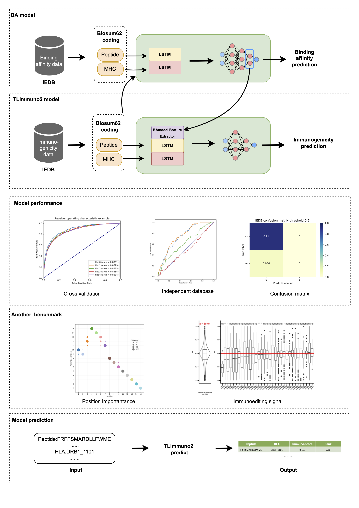

```{r knitr_init, echo=FALSE,warning=FALSE}
library(knitr)
library(reticulate)
library(rmdformats)
use_python(Sys.which("python"))
## Global options
options(max.print = "75")
opts_chunk$set(
  echo = TRUE,
  comment = "#>",
  dpi = 300,
  #eval = FALSE,
  cache = FALSE
)
opts_knit$set(width = 75)
Sys.setenv("LANGUAGE"="EN")
```

This report is written to help readers understand what and how we did in this project. Please read the formal manuscript \< \> for more details.

> This document is compiled from an Rmarkdown file which contains all code or description necessary to (auto-)reproduce the analysis for the accompanying project. Each section below describes a different component of the analysis and all numbers and figures are generated directly from the underlying data on compilation.

# Dependencies

This project is depended on Python software, Python packages, R software, R packages and other tools :

Python:

-   [pandas](https://pandas.pydata.org) - flexible and easy to use data analysis and manipulation tool
-   [numpy](https://numpy.org) - a fundamental package for scientific computing with Python
-   [tensorflow](https://www.tensorflow.org) - a open source platform for machine learning
-   [sklearn](https://scikit-learn.org/stable/) - machine learning in Python
-   [matplotlib](https://matplotlib.org) - plot fig in python.
-   [seaborn](https://seaborn.pydata.org) - visualization library based on matplotlib
-   sys,os,re - some base Python packages

R:

-   [reticulate](https://rstudio.github.io/reticulate/) - R Interface to Python
-   [NeoEnrichment](https://github.com/wt12318/NeoEnrichment) - do neoantigen enrichment for this project.
-   [tidyverse](https://www.tidyverse.org/) - tidy data
-   [data.table](https://github.com/Rdatatable/data.table) - read and tidy data
-   [survival](https://github.com/therneau/survival) - survival analysis
-   [survminer](https://github.com/kassambara/survminer) - plot survival fit
-   [DT](https://cran.r-project.org/web/packages/DT/index.html) - show data table as a table in html
-   [patchwork](https://github.com/thomasp85/patchwork) - arrange figures into complex compound figures
-   knitr, rmdformats - use to compile this file

Shell:

-   [netMHCIIpan(IEDB)](http://tools.iedb.org/mhcii/download/) - use to predict peptide binding affinity for MHCII molecules(download form IEBD, contain BA and EL method)
-   [IEDB tools](http://tools.iedb.org/CD4episcore/) - predict the allele independent CD4 T cell immunogenicity at population level
-   [MixMHC2pred](https://github.com/GfellerLab/MixMHC2pred) - a pan-allele predictor of MHC class II ligands and epitopes
-   [Repitope](https://github.com/masato-ogishi/Repitope) - a structured framework of quantitative prediction of immunogenicity
-   [annovar](https://annovar.openbioinformatics.org/en/latest/) - annotate genetic variants detected from diverse genomes

## Summary figure



## Basic information

Here are some common scripts used in our project:

> Of note, some step was done on Linux server provided by High Performance Computing(HPC) Service of ShanghaiTech University in order to reduce run time. So some scripts was sunmitted by using Portable Bash Script (PBS) scripts, we will mark them in the header by using `#PBS`. Also, there are mixture of R and Python, if readers want to reproduce this work, please focus on the key code lines.

1.PBS script format: we change `name`, `out file path` and `python file` in different work in order to submit it into HPC. File submitted by PBS will not be compiled by this report.

```{bash pbs-format ,eval =FALSE}
#PBS -N <name>
#PBS -o <out file path>
#PBS -e <out file path>
#PBS -l nodes=1:ppn=1
#PBS -l walltime=20000:00:00  
#PBS -S /bin/bash   
#PBS -q pub_gpu 

if [ -f "/public/slst/home/wanggsh/miniconda3/etc/profile.d/conda.sh" ]; then
        . "/public/slst/home/wanggsh/miniconda3/etc/profile.d/conda.sh"
    else
        export PATH="/public/slst/home/wanggsh/miniconda3/bin:$PATH"
    fi

conda activate tensorflow
python <Python file>
```

2.BLOSUM62 encoder: we use BLOSUM62 matrix to encoder peptides and MHC pseudo-sequence into numeric. Blosum62 Matrix were download from [NCBI website](https://www.ncbi.nlm.nih.gov/Class/FieldGuide/BLOSUM62.txt). The animo acid alphabet is **ACDEFGHIKLMNPQRSTVWYX**, **X** is the general wildcard character. You can find these content in [USCS](https://compbio.soe.ucsc.edu/papers/sam_doc/node9.html) and [Mathworks](https://ww2.mathworks.cn/help/bioinfo/ref/aminolookup.html). The following is the script:

```{python blosum62 ,eval = FALSE}
#python
import pandas as pd
import numpy as np

Blosum62_matrix = pd.read_csv(r"~/Data/MHCII/BLOSUM62.csv",comment="#")
Protein_alphabet = list("ARNDCQEGHILKMFPSTWYVX")
Blosum62_matrix = Blosum62_matrix[Protein_alphabet]
Blosum62_matrix = Blosum62_matrix.loc[Protein_alphabet]
Blosum62_matrix

def blosum62(peptide,maxlen):
    encoder = np.empty((maxlen,21))
    if len(peptide) <=maxlen:
        peptide = peptide + "X"*(maxlen-len(peptide))
    for i in range(len(peptide)):
        pep = list(peptide)[i]
        coder = Blosum62_matrix[pep]
        encoder[i] = coder
    return encoder.flatten()

if __name__ == "__main__":
    blosum62(peptide,maxlen)
```

3.Creating a batch of PBS job:In some steps, the data is to large, even the HPC need a lot of time to finish. So we create a batch of PBS work to speed up the analysis process. These script were marked by using `PBS_batch` in the header.File submitted by PBS will not be compiled by this report.

```{python pbs-bash-format,eval = FALSE}
#python
import os
file_path = <file path>
file = os.listdir(file_path)
pbs_path = <pbs path>
for i in file:
    pbs_text = r"""#PBS -N {0}
#PBS -o <out file path>
#PBS -e <out file path>
#PBS -l nodes=1:ppn=20
#PBS -l walltime=20000:00:00  
#PBS -S /bin/bash   
#PBS -q pub_gpu 

if [ -f "/public/slst/home/wanggsh/miniconda3/etc/profile.d/conda.sh" ]; then
        . "/public/slst/home/wanggsh/miniconda3/etc/profile.d/conda.sh"
    else
        export PATH="/public/slst/home/wanggsh/miniconda3/bin:$PATH"
    fi

conda activate tensorflow
python <Python file>
""".format(i)
    os.system("echo \"{0}\" > {1}/{2}.pbs".format(pbs_text,pbs_path,i))
    os.system("qsub {0}/{1}.pbs".format(pbs_path,i))
    print("{} submitted".format(i))
```

4.Background sequence: TLimmuno2 outputs a continuous variable between 0 and 1 and also percentile rank. we download all human peptide sequence from UniPort database(2022.3) and randomly sampling peptides. We generated a set of 90,000 13-21-mer random natural peptides (10,000 of each length). For each peptide-MHC II pair, percentile ranks were computed based on background sequence, smaller rank indicates stronger immunogenicity..The result maybe different as the reason of random select.

```{python random-bg-pep, eval = FALSE}
#python
import pandas as pd
import numpy as np
import random
#uniport data
f=open("../data/uniport_human.fasta")
ls=[]
for line in f:
        if not line.startswith('>'):
                ls.append(line.replace('\n',''))
f.close()
uniport = pd.DataFrame(ls)
uniport["length"] = uniport[0].map(len)
bool = uniport["length"]>30
uniport = uniport[bool]
bool = uniport[0].apply(lambda x: set(list(x)).issubset(set(list("ARNDCQEGHILKMFPSTWYVX"))))
uniport = uniport[bool]
uniport_random = uniport[0].values
def random_select(x,length,num,allele):
    df = []
    all = []
    for i in range(num):
        protein_num = random.randint(0,len(x)-1)
        protein = x[protein_num]
        peptide_num = random.randint(0,len(protein)-length)
        peptide = protein[peptide_num:peptide_num+length]
        df.append(peptide)
        all.append(allele)
    return df,all
Pep = []
for i in range(13,21):
    pep,all = random_select(uniport_random,i,10000,"ALL")
    Pep.extend(pep)
IMM_bg_pep = pd.DataFrame({"pep":Pep})
#IMM_bg_pep.to_csv("../data/IMM_bg_pep.csv")
```

5.ROC significant: we calculated the p-value between the two ROC's by Delong's test.

```{python}
import numpy as np
from matplotlib import pyplot as plt
import scipy.stats as st
from sklearn import metrics

class DelongTest():
    def __init__(self,preds1,preds2,label,threshold=0.05):
        '''
        preds1:the output of model1
        preds2:the output of model2
        label :the actual label
        '''
        self._preds1=preds1
        self._preds2=preds2
        self._label=label
        self.threshold=threshold
        self.show_result()

    def _auc(self,X, Y)->float:
        return 1/(len(X)*len(Y)) * sum([self._kernel(x, y) for x in X for y in Y])

    def _kernel(self,X, Y)->float:
        '''
        Mann-Whitney statistic
        '''
        return .5 if Y==X else int(Y < X)

    def _structural_components(self,X, Y)->list:
        V10 = [1/len(Y) * sum([self._kernel(x, y) for y in Y]) for x in X]
        V01 = [1/len(X) * sum([self._kernel(x, y) for x in X]) for y in Y]
        return V10, V01

    def _get_S_entry(self,V_A, V_B, auc_A, auc_B)->float:
        return 1/(len(V_A)-1) * sum([(a-auc_A)*(b-auc_B) for a,b in zip(V_A, V_B)])
    
    def _z_score(self,var_A, var_B, covar_AB, auc_A, auc_B):
        return (auc_A - auc_B)/((var_A + var_B - 2*covar_AB )**(.5)+ 1e-8)

    def _group_preds_by_label(self,preds, actual)->list:
        X = [p for (p, a) in zip(preds, actual) if a]
        Y = [p for (p, a) in zip(preds, actual) if not a]
        return X, Y

    def compute_z_p(self):
        X_A, Y_A = self._group_preds_by_label(self._preds1, self._label)
        X_B, Y_B = self._group_preds_by_label(self._preds2, self._label)

        V_A10, V_A01 = self._structural_components(X_A, Y_A)
        V_B10, V_B01 = self._structural_components(X_B, Y_B)

        auc_A = self._auc(X_A, Y_A)
        auc_B = self._auc(X_B, Y_B)

        # Compute entries of covariance matrix S (covar_AB = covar_BA)
        var_A = (self._get_S_entry(V_A10, V_A10, auc_A, auc_A) * 1/len(V_A10)+ self._get_S_entry(V_A01, V_A01, auc_A, auc_A) * 1/len(V_A01))
        var_B = (self._get_S_entry(V_B10, V_B10, auc_B, auc_B) * 1/len(V_B10)+ self._get_S_entry(V_B01, V_B01, auc_B, auc_B) * 1/len(V_B01))
        covar_AB = (self._get_S_entry(V_A10, V_B10, auc_A, auc_B) * 1/len(V_A10)+ self._get_S_entry(V_A01, V_B01, auc_A, auc_B) * 1/len(V_A01))

        # Two tailed test
        z = self._z_score(var_A, var_B, covar_AB, auc_A, auc_B)
        p = st.norm.sf(abs(z))*2

        return z,p

    def show_result(self):
        z,p=self.compute_z_p()
        return z,p
        #print(f"z score = {z:.5f};\np value = {p:.5f};")
        #if p < self.threshold :print("There is a significant difference")
        #else:        print("There is NO significant difference")
```


# The construction process of the BA model

```{r child = 'BA_model.Rmd',eval=TRUE}
```

# TLimmno2: MHC II immunogenicity prediction network based on transfer learning

```{r child = 'TLimmuno2.Rmd',eval=TRUE}
```

# TLimmuno2 outperforms existing methods in peptide-MHC II immunogenicity prediction

```{r child = 'Immunogenictit_benchmork.Rmd', eval=TRUE}
```

# Compare with another meachine learning and other deep learning methods

```{r child = 'another_machinelearning.Rmd', eval=TRUE}
```

# TLimmuno2 can learn important features that determine immunogenicity

```{r child= "immunoediting.Rmd"}
```
